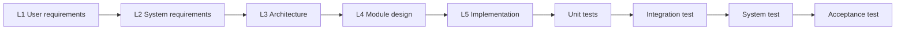

# Operating manual

How this repository is worked. Read `CLAUDE.md` first — it holds the invariants that override
everything here.

## The V-Model as it runs here

Each specification on the left arm is the literal input the next agent executes, and its paired
test on the right arm is written before anything is built. Miguel approves each level at a gate.

## Who does what

| Agent | Layer | Surface | Model | Role |
|---|---|---|---|---|
| Orchestrator | Build | Claude Code main session | Opus 5.5 | Holds V-Model state, dispatches subagents, enforces gates; writes no code itself |
| Requirements Engineer | Build | Subagent | Opus 5.5 | R-level into F-level specification and the traceability matrix |
| Architect | Build | Subagent | Opus 5.5 | Architecture, JSON data contracts, module specifications |
| Test Engineer | Build | Subagent | Opus 5.5 | Writes each paired test from its specification before implementation, then runs it |
| Implementer | Build | Subagent | Opus 5.5 | Builds modules against their specifications |
| Red-team Reviewer | Build | Subagent | Opus 5.5 | Enforces R3 and R4 invariants and honesty labels; can block a gate |
| Scout | Runtime | Subagent with web tools | Opus 5.5 | Horizon scanning against the scanning brief; signal cards with provenance |
| Trend Analyst | Runtime | Subagent | Opus 5.5 | Clusters signals into candidate trends with momentum notes |
| Rival Readers (three lenses) | Runtime | Subagents | Opus 5.5 | Opportunity, threat and noise readings, each with evidence, counter-evidence and a disconfirming condition |
| Interrogator | Runtime | Subagent | Opus 5.5 | Provenance checks, assumption probes, pre-mortem, intuition prompts |
| Verifier | Runtime | Subagent | Opus 5.5 | Checks every claim against its source, strikes the unverifiable, rejects any ranking |
| Brief Editor | Runtime | Subagent | Opus 5.5 | Compresses output to fit R1's attention budget |
| Persona and Brief Researcher | Support | Claude Cowork | Opus 5.5 | Persona dossier, scanning brief, replay candidates |
| Packager | Support | Claude Cowork | Opus 5.5 | Walkthrough script and a one-page outreach note |

Runtime agents run **once, offline**, before G3. Their output lands in `pipeline/output/`, is
verified, then frozen into `data/`. Nothing in that layer ever runs for a viewer.

## Session pattern

1. Open Claude Code in the repository root. The main session is the Orchestrator.
2. Orchestrator states the current level, the gate it is working towards and the entry criteria.
3. Orchestrator dispatches one subagent per artefact, with the specification as the literal input.
4. Test Engineer writes the paired test before the Implementer opens the module.
5. Red-team Reviewer audits against `CLAUDE.md` and either signs off or blocks.
6. Orchestrator reports to Miguel in claude.ai chat; Miguel decides the gate; the outcome is
   recorded in `docs/gates.md`.

## Schedule

Re-planned on 4 October 2026 for a hard deadline of 7 October, on Opus 5.5 only. The original
schedule (G2 on 19 Sept, build from 22 Sept) slipped while G2 waited for decisions.

| When | Work | Gate |
|---|---|---|
| 16 Sept | Requirements and assumptions approved | G1 (done) |
| 19 Sept | Levels 2 to 4 drafted; Architect and Requirements Engineer raise DM, K and Q items | — |
| 4 Oct | Miguel decides the G2 items. Requirements Engineer and Architect apply them (F5 added, level names in). Test Engineer finishes the test plan and writes every unit test. Governance-author debate (Q-5). Red-team review | G2 |
| 5 Oct | Persona dossier, scanning brief and replay candidates written in Claude Code. Runtime pipeline runs once: Scout, Trend Analyst, Rival Readers, Interrogator, Verifier, Brief Editor. Red-team review of the content. In parallel, M1, M9 and the M10 shell are built | G3 content freeze |
| 6 Oct | Remaining modules built, tests first: M5, M6, M7, M8 and F5. Integration test, then system test at the four Q-7 viewports. Red-team audit. Deploy to GitHub Pages | G4 |
| 6–7 Oct (re-plan of 6 Oct) | The 3 am run of 6 Oct did not work overnight. On 6 Oct the Scout stage, M9 and the M10 shell were finished; the rest of the pipeline, M5 to M8 and the Red-team review run in the 6 Oct afternoon and evening windows and overnight; G3 and the push on 7 Oct morning; target set by Miguel: presentable and live by midday on 7 Oct (plan in `g3-decision-pack.md`) | G3, G4 |
| 7 Oct, morning (superseded by the line above) | Rehearsal review as a hiring manager; fixes; final deploy. Demo shown at the Wels career fair on 7 and 8 Oct | G5 starts |
| After thesis interviews | Anonymised insights, under the consent clause, feed a second pass starting again at Level 1 | New G1 |

If the build is behind at midday on 6 Oct, F3, F4 and F5 ship as static screens and F1 and F2
stay fully interactive.

## Risks held open

| Risk | Mitigation |
|---|---|
| Drift into ranked recommendations | Invariants in `CLAUDE.md`; Red-team Reviewer can block any gate |
| Fabricated or stale signals | Verifier checks every claim; NF2 provenance; dated real outcome sources in the replay |
| Usage limit reached mid-run | Stop at an artefact boundary, commit, resume in the next usage window; no credit purchases and no mid-artefact switch to a weaker model |
| Demo reads as a thesis summary, not a product | Packager's walkthrough script; acceptance by real viewers |
| Unfair or inaccurate portrayal of Dynatrace | Persona brief limited to verifiable public facts; neutral framing reviewed at G3 |
| Copyright in sourced material | Short quotes only, paraphrase by default, links to originals |
| Build competes with Chapter 3 writing | From 22 Sept, work in scheduled five-hour blocks around thesis time |
