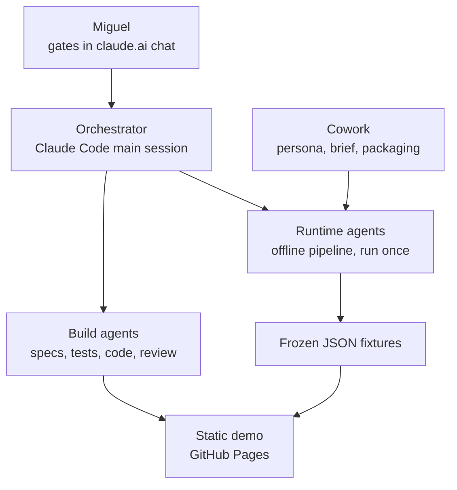
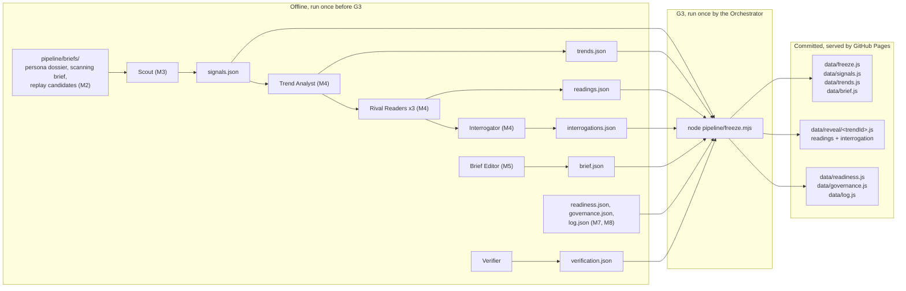
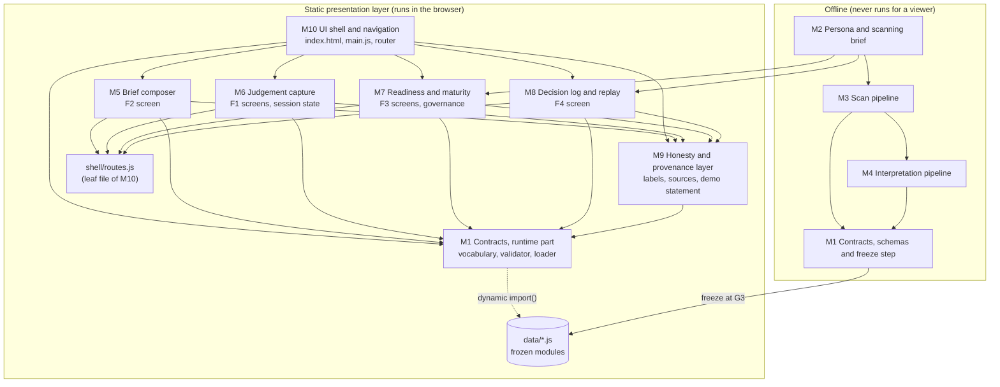

# Level 3 — Architecture

**Status: authored by the Architect on 19 September 2026; awaiting G2. Input: the expanded Level 2
specification (`02-system-requirements.md`). Ten decisions are handed to Miguel at the end of this
document, under "Decisions for Miguel"; three changes to Level 2 are requested under "Changes
requested to Level 2". `traceability.md` is updated by the Orchestrator in its consolidated pass.**

This document says how Periscope is put together: the layers, how content travels from an offline
pipeline into a static page, what the data contracts are and why each field exists, how the page
keeps the founder's intuition ahead of the machine's readings, and which part of the code may
depend on which. It is written so that a reviewer can check every design choice against the five
invariants in `CLAUDE.md` without reading any code.

## Contents

1. The shape of the system in one paragraph
2. Layers
3. How content travels: pipeline, verification, freeze, page
4. The freeze step
5. Data contracts
6. Runtime design: loading, validation and the intuition gate
7. Session state and screen addressing
8. Honesty labels in the page
9. What `file://` can and cannot promise
10. Module boundaries and dependency direction
11. Role-awareness (R7): how it would be activated
12. Answers to A-1 to A-10
13. Changes requested to Level 2
14. Follow-ups for the Orchestrator
15. Decisions for Miguel

---

## 1. The shape of the system in one paragraph

Periscope is a static web page with no server logic and no runtime AI. All content was produced
once, offline, by a pipeline of agents; it was verified claim by claim, then frozen into plain
JavaScript data files that the page imports. The page lets a viewer read a weekly brief, open a
trend, record a gut reading, and only then see three rival readings side by side, answer questions
about them and commit a judgement with a written rationale. Everything the viewer types lives in
the memory of one browser tab and disappears on reload. The architecture's job is to make the
invariants structural rather than a matter of care: a reading cannot be ranked because no contract
has anywhere to put a rank; a reading cannot leak before the gut reading because its file is not
loaded until then; a judgement cannot be committed without a rationale because the contract, the
validator and the button all refuse it.

## 2. Layers

Three layers, as given in the approved build plan.

1. **Build agents** write specifications, tests and code. They are Claude Code subagents working
   inside the V-Model gates.
2. **Runtime agents** run the content pipeline **once, offline**, before G3: Scout, Trend Analyst,
   three Rival Readers, Interrogator, Verifier, Brief Editor. Their output is frozen into the demo.
   They never run for a viewer.
3. **Static presentation layer**: vanilla HTML, CSS and JavaScript, served by GitHub Pages from the
   repository root. It reads only the frozen data modules in `data/`.

The boundary that matters most runs between the second and third layers. Nothing on the
presentation side can call back into the pipeline: there is no network client in the page, no
API key, and no endpoint to call. The only thing that crosses the boundary is a set of files
committed to the repository at G3.

## 3. How content travels: pipeline, verification, freeze, page

The raw pipeline output in `pipeline/output/` is JSON, one file per entity type, because that is
what agents write most reliably and what the Verifier reads most easily. The shipped form in
`data/` is ES modules (`export default {...}`), because the page may not `fetch()` anything and an
ES module is the only way a static page can import structured content with no network request of
its own making. The freeze step is the one translation between the two.

Two differences between the raw and shipped layouts are deliberate:

- **Readings and interrogations are regrouped by trend.** In `pipeline/output/` they are flat
  lists, which suits the agents. In `data/` each trend gets its own reveal bundle,
  `data/reveal/<trendId>.js`, holding exactly its three Readings and its Interrogation. That is
  what lets the page load one trend's readings, and only that trend's, at the moment the viewer
  records a gut reading (section 6).
- **A freeze manifest is added.** `data/freeze.js` records the freeze date and the list of modules
  written. The demo-wide statement on every screen needs the freeze date before any content module
  has loaded.

No text is changed in the translation. The freeze step wraps and regroups; it never edits.

## 4. The freeze step

**What it is.** A single script, `pipeline/freeze.mjs`, that uses only Node's built-in modules
(`node:fs`, `node:path`, `node:crypto`). It reads the JSON files in `pipeline/output/` and writes
the ES modules in `data/`. Node is already the test runner for this project (`node --test`), so the
script adds no tool, no package and no dependency.

**Why this is not a build step.** The stack rule forbids a build step so that the repository as
committed is exactly what GitHub Pages serves, with nothing generated between a commit and a
viewer. The freeze step honours that. It runs once, at the content-freeze gate, and its output is
committed and reviewed like any other file. Nothing runs when the site is deployed, and nothing
runs when a viewer opens it. It is a content operation with a reviewable diff, closer to exporting
a spreadsheet than to compiling code.

**Who runs it, and when.** The Orchestrator, at G3, in this order:

1. The runtime pipeline has finished, and the Verifier has written `pipeline/output/verification.json`
   (section 14 lists the fields the freeze step needs from it).
2. The Orchestrator runs `node pipeline/freeze.mjs`.
3. The Orchestrator runs the M1 unit tests against the new `data/`.
4. The Orchestrator commits `pipeline/output/` and `data/` together, in one commit whose message
   names the G3 date. Miguel decides G3 on that commit; the Red-team Reviewer reviews the same
   commit on 21 September.

**What the script guarantees.** Each property below is checked by an M1 unit test (M1-U11 and
M1-U13 in `04-module-design.md`).

- *Nothing unverified ships.* The script refuses to run if any entity in `pipeline/output/` lacks
  a `pass` verdict in the verification record, or if the SHA-256 hash of the entity's canonical
  JSON differs from the hash the Verifier recorded. A claim edited after verification therefore
  cannot slip into `data/` unverified. This also constrains the pipeline order; see F-2 in
  section 14.
- *Nothing fails the contracts.* It validates every entity against its schema before writing, and
  stops on the first failure, writing nothing.
- *No hand edits survive.* It is deterministic: stable key order, two-space indentation, one
  trailing newline, a fixed header comment (`// Frozen at G3 on <date> from pipeline/output/.
  Generated by pipeline/freeze.mjs; do not edit by hand.`). Re-running it on the committed
  `pipeline/output/` must reproduce `data/` byte for byte, so any hand edit to `data/` makes the
  test fail.
- *Data modules are inert.* Each output file contains a comment and one `export default` of a
  plain object or array literal. No imports, no functions, no expressions.

## 5. Data contracts

The contracts are JSON Schema (draft 2020-12) files in `schemas/`. Seven describe the entities
named in the brief; four more describe containers that the specification or the loading design
needs; one holds shared definitions.

| File | Kind | Shipped as | Rendered as an element |
|---|---|---|---|
| `signal.schema.json` | Entity | `data/signals.js`, array | Yes |
| `trend.schema.json` | Entity | `data/trends.js`, array | Yes |
| `reading.schema.json` | Entity | inside `data/reveal/<trendId>.js` | Yes |
| `interrogation.schema.json` | Entity | inside `data/reveal/<trendId>.js` | Yes |
| `judgement.schema.json` | Entity | never shipped; created in the tab | Yes |
| `readiness-profile.schema.json` | Entity | `data/readiness.js` | Yes |
| `log-entry.schema.json` | Entity | `data/log.js`, array | Yes |
| `brief.schema.json` | Container (A-2) | `data/brief.js` | Yes, as the brief header |
| `governance.schema.json` | Container (A-2) | `data/governance.js` | Yes, as the governance screen |
| `reveal-bundle.schema.json` | Shipping container | `data/reveal/<trendId>.js` | No |
| `freeze-manifest.schema.json` | Shipping container | `data/freeze.js` | No |
| `common.schema.json` | Shared definitions | — | — |

### 5.1 Rules that hold across every contract

**Every object is closed.** Every object schema sets `additionalProperties: false`. A field that is
not in the contract cannot be added by an agent, at any depth, without the fixture failing
validation. This is the first line of defence against a `score` or `rank` creeping in.

**There are no numbers, integers or booleans anywhere.** No schema declares `type: number`,
`integer` or `boolean`. This is stronger than banning four field names: it removes the only data
types in which a score, weight, likelihood, probability, rank position, rating or "featured" flag
could be carried at all. Counts that the UI needs (how many signals were withheld) are computed at
runtime, never stored. The M1 unit tests check both this rule and a banned-name list, which covers
the four names in the invariant plus their near synonyms.

**Enumerations are allowlisted.** A text enumeration can carry a ranking as easily as a number can
("high", "medium", "low"). The schemas use exactly five enumerations: the honesty label (and a
two-value subset of it for generated content), the lens, the producer, the maturity verification
status and the readiness category key. None of them is ordinal. A unit test fails if any other
enumeration appears.

**Identifiers cannot encode an order.** Identifiers are built from dates and word slugs, and every
slug segment must begin with a letter: `sig-2026-02-11-otel-profiling`,
`trend-open-telemetry-profiling`, `reading-open-telemetry-profiling-noise`. An identifier such as
`trend-1` is rejected by the pattern. Without this rule a sequence number, assigned by an agent in
the order it thought most important, would silently survive into a tie-break (C-4 breaks ties by
identifier).

**Every factual claim carries its own dated source.** The unit of sourcing is the claim, not the
entity. A `sourceRef` (URL, publisher, optional title, publication date, retrieval date, all but
the title required) is attached to each evidence item, each counter-evidence item, each replay
signal, each replay outcome, each governance argument paragraph, and the framework citations.

**Every entity carries `provenance` and `label`.** How these two work is the part of the design a
reviewer is most likely to question, so it is set out in full below.

### 5.2 Provenance: why some source fields are null

The brief for these contracts asks that every entity carry a provenance block with a source URL,
a publication date and a retrieval date. Read literally, that cannot be honest for an entity that
was generated rather than published. A Trend has no URL: it is a synthesis written by the Trend
Analyst, resting on several signals, each with its own URL. Inventing a URL for it, or copying one
signal's URL onto it, would misrepresent where it came from.

So every entity carries the same provenance block, with the same seven keys, and the block says
one of two things:

- **This entity is itself a published item.** `sourceUrl`, `publisher`, `publishedOn` and
  `retrievedOn` are set. This applies to Signals, where the schema requires it
  (`publishedProvenance`).
- **This entity was generated or authored.** The same four fields are `null`, and the claims
  inside it carry their own `sourceRef`. The schema enforces that the four fields are either all
  set or all null, so a half-sourced entity cannot exist.

The remaining three keys say who produced the entity and when: `producedBy` (one or more of the
pipeline agents, the Cowork persona researcher, a named human author, or the viewer),
`producedOn`, and `frozenOn` (the G3 date). Fixture entities must have a `frozenOn` and may never
name the viewer as producer. The viewer's Judgement must have `frozenOn: null`, `producedBy:
["viewer"]` and no external source.

This satisfies invariant 4 ("every factual claim is sourced") exactly, and satisfies the
provenance constraint in its intent while making it honest. Because it departs from the letter of
the constraint, it is listed for Miguel as **DM-3**.

### 5.3 Labels: what the schemas fix and what they leave open

The honesty vocabulary is `real | ai-generated | frozen | fictional | replay`, from `CLAUDE.md`.
It is not extended anywhere in these contracts. Level 2 (K-3) found three gaps in it; the design
handles each as follows.

**Composite items: per-part labels.** A Signal is real, but its English summary was written by the
Scout. A replay entry holds a real signal, a judgement attributed to a fictional team, and a real
outcome. A single label per entity would be wrong for part of each. The contracts therefore carry
one `label` on the entity as a whole and a separate `label` on any part whose origin differs, using
a shared `labelledText` shape (`{ text, label }`) or a `label` on the embedded object. The rule the
UI follows is simple: a part with its own label shows its own label; any other part is covered by
the entity's label. This stays within the vocabulary.

**Origin versus time status.** Every fixture is both frozen and something else (AI-generated,
real, fictional). The proposed rule (**DM-2**) is that the element label states *origin*; that the
demo-wide statement on every screen, plus `provenance.frozenOn` in the data, carries the time
status for all content at once; and that `frozen` is used as an element label only for assembled
containers whose content is otherwise labelled (the brief). The schemas are written so that this
rule can be adopted or replaced without a schema change: where the label is certain, it is fixed
(`Signal` is `real`, `LogEntry` and the past judgement are `replay`, the outcome and replay signals
are `real`, the readiness profile is `fictional`, the brief is `frozen`); where it depends on the
decision, the schema allows only the honest candidates (Trend, Reading and Interrogation accept
`ai-generated` or `frozen`, never `real` or `fictional`).

**Text the viewer types.** None of the five values describes the viewer's own gut reading or
rationale, and I have not found an honest way to make one fit (see **DM-1** for the options). The
Judgement schema admits the vocabulary unchanged and does not choose a value. M6 cannot label the
viewer's entries until Miguel decides.

### 5.4 Entity by entity: the fields a reviewer would question

**Signal.** One real, dated, published item.

- *No `trendIds` field.* Level 2 describes a Signal as knowing "the trend or trends it belongs
  to". The contracts put that link on one side only, the Trend (`signalIds`), because the Trend
  Analyst is the agent who creates the relation; the Scout, who writes signals, does not know the
  trends yet. Holding the link on both sides would let them disagree. The UI inverts
  `Trend.signalIds` at load time to draw the links in F2 (A-3).
- *`summary` and `relevanceNote` are `labelledText`,* because they are written by the pipeline
  while the signal is real.
- *`sourceLanguage`* records whether the source is English or German, for the `lang` attribute
  (accessibility) and for the German-coverage record in NF6.
- *`windowNote`* exists because the Scout's brief says a source outside the scanning window must
  be flagged, not hidden.
- *The source lives in `provenance`,* not in a separate field, because for a Signal the entity
  and its source are the same thing.

**Trend.** A cluster of signals, lens-neutral, shown before the gut reading.

- *`readings` holds three references, not three readings.* Each reference is `{ lens, readingId }`
  and nothing else. This is how the Trend "holds exactly three Readings" without putting any
  reading text into a file that loads before the intuition record. The references are enough to
  enforce the rule that matters: `minItems: 3`, `maxItems: 3`, and, for each lens, a
  `contains` / `minContains: 1` / `maxContains: 1` clause. Together those force exactly one
  opportunity, one threat and one noise reference. (The dispatch assumed JSON Schema cannot express
  lens uniqueness; since draft 2019-09 it can, through `minContains` and `maxContains`, and these
  schemas use it.) What the schema cannot express is that each reference points at a real Reading
  with the same trend and lens; that is the M1 referential-integrity test, M1-U9.
- *Array order carries no meaning.* The readings are unordered peers. The UI ignores array order
  and places them in the fixed alphabetical lens order of C-4 (noise, opportunity, threat, pending
  Q-2). M6-U7 renders every one of the six permutations and requires identical output.
- *`intuitionPrompt` sits on the Trend,* not the Interrogation. It is the only question the viewer
  sees before the readings, so it must load with the Trend; the rest of the Interrogation loads
  afterwards (A-4). The Trend's provenance therefore names two producers, `trend-analyst` and
  `interrogator`.
- *No momentum or strength field.* The Trend Analyst's brief asks for a "momentum note", including
  how strongly the signals support the movement. That becomes prose in `summary`, subject to the
  language rule C-6; there is no separate field, because a separate strength field is a rating by
  another name.

**Reading.** One rival reading through one lens.

- *Identity is trend plus lens, nothing else.* No strength, likelihood, confidence or position.
- *`evidence` and `counterEvidence` have the same shape* and the same minimum (at least one item
  each, each with a dated source). The case against a reading is not a lesser kind of content, and
  the contract does not let it be thinner.
- *`disconfirmingCondition` is required prose.* Whether it is observable and checkable is a
  content question for the Verifier and Red-team; the contract guarantees it is there.
- *`signalId` on a claim is optional,* to let the Verifier cross-check a claim that draws on a
  signal, without forcing every piece of evidence to come from the brief.

**Interrogation.** The questioning layer for one trend.

- *Per trend, not per reading (A-4).* The Interrogator's brief frames assumption probes as
  questions about "this reading". Attaching them to individual readings would let one lens receive
  more questioning than another, which is a quiet form of emphasis. Holding them per trend, with
  the Red-team checking for lens imbalance, keeps the three readings equal.
- *Each group is capped at three questions.* The cap protects the eight-minute budget (NF4). It is
  a design parameter, not a requirement, and Miguel may change it (listed under DM-9).
- *Every question must end with a question mark.* The Interrogator's rule is "questions, not
  advice"; the pattern makes a stray recommendation phrased as a statement fail validation.
- *Each question has an `id`,* so that the viewer's optional answers can refer to it.

**Judgement.** The viewer's own record, created in the tab, never stored.

- *The intuition record is embedded and required.* `intuition` holds `gutCall` (a lens), `reason`
  (one line, or null) and `recordedAt`. A Judgement without it fails validation. Between the gut
  reading and the commit, session state holds the intuition record on its own; at commit, the same
  frozen object is embedded unchanged (A-1).
- *Three timestamps make "preceding" checkable.* `intuition.recordedAt`, `readingsRevealedAt` and
  `committedAt` are ISO instants taken from the browser clock. The rule is `recordedAt ≤
  readingsRevealedAt ≤ committedAt`. JSON Schema cannot compare two values, so the M1 runtime
  validator checks this, and M1-U10 and M6-U13 test it. These timestamps live only in memory, like
  everything else in the Judgement.
- *`committedLens` and `gutCall` are separate fields that are never compared.* The demo does not
  evaluate the viewer (F1 rules).
- *`rationale` requires at least one non-whitespace character* (pattern `\S`) and nothing more.
  There is no minimum length, because a minimum would be a grade.
- *`role` is optional* (R7, section 11).
- *Replay judgements are not Judgements.* They have no genuine intuition record, and inventing one
  would be a fabrication. They are modelled inside LogEntry.

**ReadinessProfile.** Tracewell's position on the five Jöhnk et al. (2021) categories and the
maturity view (A-10).

- *No numbers.* A category holds answers (question and answer pairs from the persona dossier) and a
  prose `finding`. There is no score, no bar value, no traffic-light enumeration. M7-U3 checks that
  the screen renders no meter, progress bar or width-scaled element either.
- *The five categories are forced by key.* Five items, each key once, by the same
  `contains`/`minContains`/`maxContains` technique as the lenses. Here array order is meaningful,
  and the schema says so: it is the order in which the paper presents the categories (C-4), never
  an order of findings.
- *The maturity level is a name, with no level number.* Storing "level 2 of 5" would put an
  ordinal scale into the data. The name alone is enough for F3 at G2, and the level criteria come
  from the verified report when D-1 is resolved.
- *The placeholder is enforced by the schema.* While `status` is `unverified`, `levelName` must be
  the literal `LEVEL_NAME_UNVERIFIED` and `explanation` and `report` must be null. Only when
  `status` is `verified` may a real name appear, and then the report citation is required. Only
  Miguel changes `status`.
- *`nextComplement` is pinned to null.* K-2 asks whether a single next complement is compatible
  with the no-recommendation invariant at all. Until Miguel decides, the contract has no shape into
  which a recommendation could be written.

**LogEntry.** One retrospective replay entry.

- *Composite, with per-part labels.* The entry is `replay`; each original signal and the outcome
  are `real`; the past judgement is `replay`; the calibration note carries its own label, which
  depends on K-3 and K-7.
- *`asOfDate` and `authoredOn`.* The past judgement is presented as of early 2026, but it was
  written in September 2026, after the outcome was known (K-7). Both dates are in the data, so the
  after-the-fact authorship is recorded in the contract and not only in the replay statement.
  M8-U7 checks that `asOfDate` falls on or after the latest original signal and before the outcome.
- *No verdict field.* There is no `held: true`, no hit/miss enumeration, nothing that could be
  tallied across entries into a hit rate. The calibration note is prose.
- *Replay signals are embedded, not referenced.* They come from an earlier window than the brief
  and have no relevance note, so they are not `Signal` entities.
- *`role` is optional,* on the entry, as the constraint specifies (R7).

### 5.5 Containers (A-2)

**Brief.** Level 2 needs something that holds one weekly brief: its period, its freeze date and its
signals. I made it a schema rather than a plain data module for two reasons. First, it is rendered
(the brief header shows the period and freeze date) and every rendered element must carry a label;
a schema guarantees it does. Second, an unvalidated module would be the one place where an extra
field such as a "featured" signal identifier could slip through. The brief holds signal
identifiers, not signals, so each signal's text exists in exactly one place, and the order of the
identifiers carries no meaning, so the Brief Editor cannot express a preference through position.
The cap `BRIEF_SIGNAL_CAP` is not in the schema because its value is still open (Q-3); M5-U1
enforces it.

**Governance.** The governance screen's content is also a schema, because R8's acceptance depends
on it and because it makes regulatory claims that must be sourced. The seven statements Level 2
requires (four implemented, three not) are pinned by identifier, so the screen cannot ship without
them. Every "implemented" statement names the test that verifies it (`verifiedBy`), turning a
claim about the demo into a checkable one. Every paragraph of the argument carries at least one
dated source.

**RevealBundle** and **FreezeManifest** are shipping containers, not content. They are never
rendered as elements of their own, so they carry no label or provenance; the entities inside them
do.

## 6. Runtime design: loading, validation and the intuition gate

### 6.1 Loading: every data module through one gate

No application code imports anything from `data/` with a static `import` statement. All data is
loaded through the M1 loader (`assets/js/contracts/load.js`), which uses dynamic `import()` with a
fixed, literal module path for each data module, validates what it receives, deep-freezes it and
memoises it for the rest of the session.

This choice answers the second half of A-5. A static import that fails (a missing file, a syntax
error) takes down the whole module graph, so one bad data file would blank the entire demo. A
dynamic import fails alone: the loader returns a typed failure, and the one screen that needed that
data shows its own error state (`F2-E1`, `F3-E1`, `F3-E2`, `F4-E1`), while every other screen keeps
working.

Start-up needs only one data module, `data/freeze.js`, because the demo-wide statement on every
screen needs the freeze date. If it fails, or if any script fails before the shell is ready, the
static `G-E1` message stays up. That message is plain HTML in `index.html`, visible by default and
removed by script only after a successful start, so it also appears when JavaScript is disabled or
when a browser refuses to load the scripts at all (section 9).

### 6.2 Validation in the browser, with no dependencies (A-5)

The browser cannot use a JSON Schema library: there is no package manager to install one and no
CDN to load one from. Writing a full JSON Schema interpreter to ship in the page would be a large
piece of code for a small benefit. The design has two validators with deliberately different jobs.

- **At test time: the full contracts.** A small JSON Schema interpreter written for this project
  lives in `tests/lib/mini-schema.mjs`. It supports only the keywords these schemas use (`type`,
  `properties`, `required`, `additionalProperties`, `items`, `minItems`, `maxItems`, `uniqueItems`,
  `contains`, `minContains`, `maxContains`, `enum`, `const`, `pattern`, `minLength`, `maxLength`,
  `allOf`, `oneOf`, `not`, `if`/`then`/`else`, `$ref`, `$defs`, and the annotations `$schema`,
  `$id`, `title`, `description`). It throws on any keyword it does not know, so a schema can never
  quietly use a rule that nothing enforces (M1-U7). Every fixture is validated against its full
  schema by M1-U1. The interpreter is test tooling and never ships.
- **In the browser: the invariant-guarding checks.** `assets/js/contracts/validate.js` is a
  hand-written set of check functions, one per entity and container (`checkSignal`, `checkTrend`,
  `checkRevealBundle`, `checkJudgement` and so on). It implements the structural checks Level 2
  lists in each flow's preconditions, plus a deep scan for banned field names at any depth. It is a
  deliberate subset of the schemas, because its job is to guard the invariants at the point of
  rendering, not to re-prove what the tests already proved.

**How the two are kept in step.** Three mechanisms, all tested:

1. *One source for the vocabulary.* The label values, lens values, banned name tokens and
   identifier patterns are defined once, in `assets/js/contracts/vocabulary.js`, and used by the
   runtime validator. M1-U5 asserts that every enumeration and pattern in the schemas equals the
   corresponding constant, so the two cannot drift apart silently.
2. *Mutation agreement.* M1-U6 takes a valid sample of every entity and generates mutants: each
   required field removed in turn, a `score` field added at every object level, a duplicate lens, a
   fourth reading, an empty or whitespace-only rationale, a missing evidence source date, and so
   on. Every mutant in an invariant-guarding class must be rejected by **both** the schema
   interpreter and the runtime validator. If either accepts one, the test fails.
3. *A change rule.* A change to any schema must come with a change to `validate.js` and to the
   mutant list, or with a sentence in the commit message saying why neither is needed. The Red-team
   Reviewer checks this at each gate.

**Which checks run in the browser**, by flow:

| Flow | Checked in the browser before rendering | On failure |
|---|---|---|
| F1, trend record | Exactly three reading references, one per lens; non-empty title, summary and intuition prompt; every `signalId` resolves; label in vocabulary; no banned field at any depth | `F1-E2`, whole trend withheld |
| F1, reveal bundle | Exactly three Readings whose lenses and identifiers match the Trend's references; each with non-empty text, at least one evidence and one counter-evidence item with dated sources, and a disconfirming condition; an Interrogation with at least one question per group; labels; no banned field | `F1-E3` (proposed, section 13) |
| F1, judgement | Intuition present; order of the three timestamps; committed lens; rationale with a non-whitespace character | Commit refused |
| F2 | Per signal: URL, publisher, both dates, summary, relevance note, label; quote within `QUOTE_MAX_WORDS`; brief container shape | `F2-W1` per signal, `F2-E1` for the brief |
| F3 | Five categories, each with answers and a finding; maturity placeholder rule; governance container shape | `F3-E1`, `F3-E2` |
| F4 | Per entry: signal dates in the replay window, outcome source dated after the signals, non-empty rationale and calibration note, labels | `F4-W1` per entry, `F4-E1` for the log |

### 6.3 Readings stay out of the page until the intuition is recorded (A-6, K-4)

Invariant audit 2 in the test plan says no AI reading may be reachable "in the DOM *or in module
state*" before the intuition step is recorded. If reading content shipped in `data/trends.js` and
was imported at start-up, its text would sit in the page's memory from the first moment, hidden
but present. Level 2 rightly refused to settle this by reading the audit narrowly.

**The mechanism.** Reading content ships only in the per-trend reveal bundles,
`data/reveal/<trendId>.js`. Nothing imports a reveal bundle statically, and nothing preloads one
(no `<link rel="modulepreload">`, no prefetch). The only code path that loads one is
`loadReveal(trendId)` in the M1 loader, and the only caller of `loadReveal` is M6's
"Record my gut reading" handler, after the intuition record has been written and frozen. The
sequence is:

1. `F1-S1`: the page holds the Trend (title, summary, signals, intuition prompt, and three lens
   names with reading identifiers, which are not reading content) and nothing else about the trend.
2. The viewer chooses a gut call and activates "Record my gut reading".
3. M6 writes the intuition record into session state, freezes it, and disables the gut-reading
   controls.
4. M6 calls `loadReveal(trendId)`, which dynamically imports that trend's bundle and validates it.
5. M6 stamps `readingsRevealedAt` and creates the reading elements (`F1-S2`).

Before step 4 the reading text is not in the DOM, not in any JavaScript object, and not in the
browser's module map, because the module has never been requested. The audit's wording therefore
holds literally and does not need narrowing.

**Why this is honest, and what it does not claim.** The reveal bundles are public files on a
public website. A determined viewer could open `data/reveal/<trendId>.js` directly or read the
repository on GitHub. That is not a breach of the invariant: the invariant is about what the
*demo* reveals and in what order, not about secrecy. The architecture makes the demo's own path
incapable of showing a reading early; it does not, and need not, stop someone from reading the
source.

**Per trend, not all at once.** Recording a gut reading on one trend loads that trend's readings
only. Another trend's readings stay unloaded until its own intuition is recorded, which is why the
bundles are split per trend.

**How it is tested.** M6-U1 injects a spy in place of `loadReveal` and asserts it has not been
called while `F1-S1` is showing, and that the serialised DOM (including attributes, comments and
`<template>` contents) contains none of the fixture's reading strings. M6-U2 asserts that the spy
is called exactly once after the record. M10-U4 statically checks that no file other than the M1
loader mentions `data/reveal/` and that no `modulepreload` exists. At system level, the test reads
`performance.getEntriesByType('resource')` in `F1-S1` and requires that no `data/reveal/` entry
exists.

**The consequence for Level 2.** F1 precondition 2 asks for the readings to be checked before the
trend is shown, and withholds the whole trend (`F1-E2`) if they fail. With this mechanism the
browser cannot check reading content before the gut reading, because it does not yet have it. The
checks split: everything on the Trend record is checked before `F1-S1`; the reveal bundle is
checked after it loads, and if it fails the readings are withheld and a new state, `F1-E3`, says
so. The full contract of every bundle is still proved before the demo ships (M1-U1, M1-U9), so
`F1-E3` should never occur in a shipped build, just as `F2-S2` should not. This is a change to
Level 2, requested in section 13 and listed as **DM-5**. Miguel is also asked to ratify the
mechanism itself as **DM-4**, since Level 2 asked for this question to be settled "in coordination
with Miguel".

## 7. Session state and screen addressing (A-8)

**One in-memory object per page load.** `assets/js/state/session.js` (M6) exports
`createSession()`, which returns a plain object holding a `Map` from trend identifier to that
trend's progress. `main.js` calls it once at start-up and passes the object to the screens that
need it. It is not attached to `window` and not held in a module-level singleton, so each unit test
can create a fresh session.

Each trend's progress moves through three stages, in one direction only:

| Stage | Held | Screen |
|---|---|---|
| `awaiting-intuition` | Draft gut call and reason (mutable) | `F1-S1` |
| `intuition-recorded` | Frozen intuition record; `readingsRevealedAt`; draft prompt answers, committed lens and rationale (mutable) | `F1-S2`, `F1-S3` |
| `committed` | Frozen Judgement | `F1-S4` |

Frozen here means `Object.freeze`: once recorded, the intuition record and the Judgement cannot be
changed by any code path, which is how "locked read-only for the rest of the session" is enforced
below the UI.

**Addressing screens by URL fragment.** Screens are addressed by hash routes: `#/brief` (the entry
screen, and the default when the fragment is empty), `#/trends`, `#/trend/<trendId>`,
`#/readiness`, `#/governance`, `#/log`. Changing the fragment does not reload the page, so session
state survives navigation, including the browser's back and forward buttons, and fragments work
identically on GitHub Pages and from a file. `#/trend/<id>` for an identifier that is not in
`data/trends.js` gives `F1-E1`. An identifier is checked against the trend list and the
identifier pattern before it is ever used to build a module path, so a crafted fragment such as
`#/trend/../../x` cannot make the loader import an arbitrary file (M1-U12).

**Nothing the viewer types enters the URL.** The browser's history is a form of storage. The
fragment carries only the screen address, never a gut call, answer or rationale (M6-U14).

**Nothing is stored, including by the browser on the viewer's behalf.** No code touches
`localStorage`, `sessionStorage`, IndexedDB, cookies, the Cache API or a service worker (M10-U2).
Every text field sets `autocomplete="off"` so that the browser's own form history does not keep the
viewer's words either (M6-U14). Reloading the page discards everything, as C-1 requires.

## 8. Honesty labels in the page (A-7)

Every rendered content element carries its label twice. The machine-readable form is a
`data-label` attribute whose value is one of the five vocabulary words. The visible form is a short
text badge rendered by M9 next to the element (for example "AI-generated" or "Real source"). Both
come from the same call, `renderLabel(value)`, which throws for any value outside the vocabulary.
Content elements are marked with `data-content`, so a test can find every one and check both forms
(M9-U1).

Granularity follows the per-part rule in section 5.3: one label for each entity element, and an
additional label for each part that carries its own. Peers always carry identical labels (all
three readings share one), so a label never distinguishes one item from its peers, which C-4
forbids. The demo-wide statement ("All content was produced offline and frozen on
<frozenOn>; nothing in this demo calls an AI service or the network") is rendered by M9 on every
screen, using the date from `data/freeze.js`.

The labelling of the viewer's own entries waits for DM-1. Until then M6 renders them with a
neutral visual treatment and no vocabulary label, and M9-U1 is expected to fail on them. That
failure is correct: it is the test reporting an undecided invariant question, not a defect to be
worked around.

## 9. What `file://` can and cannot promise (A-9)

`CLAUDE.md` says frozen content ships as ES modules "so the demo also works from `file://`". That
sentence promises more than the platform delivers.

**What is true.** The demo makes no network request of its own, so it needs no server logic, no
API and no internet connection. It works from GitHub Pages, and from any local static web server
(for example `python -m http.server`, or a small Node script the Test Engineer may keep in
`tests/`), in every current browser.

**What is not true.** Opening `index.html` directly from disk does not work in every browser.
Chromium-based browsers (Chrome, Edge, Brave, Opera) refuse to load ES module scripts from
`file://` URLs, because module scripts are fetched under CORS rules and a file has an opaque
origin. This applies to static and dynamic imports alike, so no arrangement of ES modules gets
round it. Firefox is understood to load ES modules from `file://` when the modules sit in the same
directory tree as the page, which ours do. Safari's behaviour from `file://` has not been
established for this project. These statements describe browser behaviour as the Architect
understands it on 19 September 2026. The integration test is what establishes it, and its result
should be recorded here once it has run.

**What the demo does in a browser that refuses.** It fails closed. The module scripts never run,
so the static `G-E1` message stays on screen. I propose that the message include one extra
sentence: "If you opened this file directly from your disk, some browsers block it; please use the
hosted version." Level 2 fixes the wording of `G-E1` in C-3, so this is a proposal for the
Requirements Engineer, not a change I am making.

**What the NF1 integration test covers.**

| Route | Browser | Expected result |
|---|---|---|
| Local static server, offline | Current Chromium (Chrome or Edge) | F1 to F4 complete; no request outside the page's own files |
| Local static server, offline | Current Firefox | Same |
| `file://` | Current Firefox | F1 to F4 complete; no network request |
| `file://` | Current Chromium | `G-E1` shown, nothing else renders, no network request |
| `file://` | Safari | Not covered; no macOS machine in the toolchain is assumed |

**The only alternative, and why I do not recommend it.** Classic (non-module) scripts do load from
`file://` in Chromium. Data could ship as classic scripts that assign to a global variable, and the
reveal bundles could be loaded by inserting a `<script>` element after the gut reading. That would
make `file://` work everywhere, but it contradicts the stack rule in `CLAUDE.md` that frozen content
ships as ES modules with `export default`, and it gives up module scoping for a route no real
viewer takes: the audience is sent a link to the hosted page. This is **DM-6**: narrow the
`file://` claim in `CLAUDE.md` (recommended), or change the stack rule.

## 10. Module boundaries and dependency direction

The ten modules split into two groups. M1 to M4 own content and contracts, most of which are
produced offline; M5 to M10 own the page. Module-level detail, including each module's files and
tests, is in `04-module-design.md`.

**The rules the diagram encodes.**

- **Dependencies point one way: shell, then screens, then honesty layer, then contracts.** M1's
  runtime part imports nothing. M9 imports only M1. The four screen modules (M5 to M8) import M1,
  M9 and one leaf file of M10, `shell/routes.js`, which builds route strings such as
  `#/trend/<id>` and itself imports nothing. M10 imports the screens, M9 and M1. There are no
  cycles.
- **Screens do not import each other.** F2 links into F1 by route string, not by calling M6. This
  keeps each flow testable alone and means a failure in one flow's data cannot break another's.
- **Only M1 touches `data/`.** No other file imports a data module, statically or dynamically.
  This is what makes the intuition gate auditable in one place.
- **Nothing in the page imports from `pipeline/`, `schemas/` or `tests/`.** The offline side
  produces files; the page consumes the frozen result.
- **Offline, content flows M2 to M3 to M4,** with M2's persona dossier also feeding M7's readiness
  profile and M2's replay candidates feeding M8's log. M3 and M4 write to M1's schemas, and M1's
  freeze step is the only way into `data/`.

M10-U4 checks these rules by reading every `import` statement in `assets/js/` and comparing the
graph with the permitted edges above.

**Logic apart from rendering.** Each screen module separates pure functions (ordering, gating,
state transitions, validation) from the function that renders into the DOM. Pure functions are
unit-tested under `node --test` with no DOM. Rendering is tested in a real browser through a test
page in `tests/unit/`, since there is no package manager with which to install a simulated DOM.

## 11. Role-awareness (R7): how it would be activated

R7 asks for a role-aware data model that collapses cleanly to a single founder, designed for and
not built. In this build the only trace of it is an optional `role` field on `Judgement` and on
`LogEntry`: a short slug such as `ceo` or `cto`, absent in every fixture, never set by the UI and
never read by any rendering code. Absence means "the sole founder", so a single-founder team is the
same model with the field left out, and no code path needs a special case. In a real build, role
awareness would be switched on in three steps, all of which depend on the persistence and account
model that the governance screen lists as not implemented and that R8 makes conditional on
verified GDPR and EU compliance (a small team's judgements, tied to named roles, are personal
data). First, team membership would come from an authenticated workspace, and the role would be
stamped on each Judgement from the signed-in member, never typed. Second, the intuition step would
become per person: each founder records a gut reading on a trend before seeing the readings *and*
before seeing any colleague's gut reading, which extends R4's protection from the machine's
influence to the loudest person's influence. Third, a trend would hold one Judgement per role plus
a team judgement whose rationale must address the individual ones, and the decision log would let
the team review calibration by role. That review would stay qualitative, with no per-person hit
rate, because a tally of who was right is a ranking of people, and invariant 1 applies to people
as much as to options.

## 12. Answers to A-1 to A-10

**A-1. Entity shapes.** Section 5 and the files in `schemas/`. The intuition record is a required,
embedded object inside Judgement (`intuition`), and session state holds the same object on its own
between the gut-reading step and the commit. "Preceding" is made checkable by three timestamps and
enforced by the runtime validator, since JSON Schema cannot compare values.

**A-2. Containers.** New schemas, not plain modules: `Brief` and `Governance` are rendered and must
be labelled and closed against stray fields (section 5.5). Two shipping containers,
`RevealBundle` and `FreezeManifest`, follow from the loading design.

**A-3. Signal-to-trend link.** Held on the Trend only (`signalIds`); the UI derives the reverse
link. M5-U4 proves that every signal in the brief appears in at least one Trend's `signalIds`, and
names any orphan.

**A-4. Interrogation structure.** Assumption probes are per trend, not per reading, so no lens
receives more questioning than another. The intuition prompt is held separately, on the Trend,
so that the rest of the Interrogation loads only after the intuition record. This means the
Interrogator writes its intuition prompt into the Trend record (F-1 in section 14).

**A-5. Runtime checks and loading.** Section 6.1 (dynamic import through one loader, per-screen
error states, `data/freeze.js` as the only start-up dependency, static `G-E1`) and section 6.2
(the checks that run in the browser, the hand-written validator, and how it is kept in step with
the schemas).

**A-6. Readings before intuition (K-4).** Section 6.3: per-trend reveal bundles, loaded by dynamic
`import()` only from the gut-reading handler. The audit's wording holds literally. Two follow-on
decisions: DM-4 (ratify) and DM-5 (the resulting `F1-E3` state).

**A-7. Label mechanism.** Section 8: a `data-label` attribute and a visible badge from one
function, per entity and per differently-labelled part. The semantics await DM-1 and DM-2.

**A-8. Session state.** Section 7: one in-memory object per page load, frozen records, hash routes
that carry only the screen address, `autocomplete="off"`, no browser storage.

**A-9. `file://`.** Section 9: works from a local server in all current browsers; from `file://`
in Firefox (to be confirmed by the integration test), not in Chromium, where it fails closed to
`G-E1`; Safari not covered. The claim in `CLAUDE.md` needs narrowing: DM-6.

**A-10. ReadinessProfile without a score.** Section 5.4: answers and prose findings per category;
no number, integer or boolean anywhere in any schema; the maturity level held as a name without a
level number; the placeholder and the null next complement pinned by the schema.

## 13. Changes requested to Level 2

Level 2 is the Requirements Engineer's. The architecture needs three changes there, which I
request rather than make.

- **C-R1. New state `F1-E3`, and F1 precondition 2 split in two** (follows from section 6.3; DM-5).
  Checks on the Trend record run before `F1-S1`; checks on the readings and interrogation run after
  the reveal bundle loads. Proposed state: `F1-E3`, "Readings withheld": the locked gut reading
  stays visible, and the message reads "The readings for this trend were withheld because their
  content failed validation. Your gut reading is kept for this session." No reading and no
  interrogation question is shown. F1 exit criterion 2's "immediately after step 3" should read
  "once the readings have loaded after step 3", since loading is asynchronous (it takes
  milliseconds from the same site).
- **C-R2. A state for "trend data could not be loaded".** If `data/trends.js` itself fails, neither
  `F1-S0` nor `F1-E2` fits. Proposed `F1-E0`: "Trend cards could not be loaded in this build." In
  F2, signals would then show the existing `F2-S2` wording in place of their trend links.
- **C-R3. A not-found state for unknown routes,** for example `#/nothing`: "This page does not
  exist in this build," with a link to the brief. Also, the optional `file://` sentence for `G-E1`
  proposed in section 9.

## 14. Follow-ups for the Orchestrator

These do not need Miguel. They are consequences of the contracts for other agents' instructions,
which I may not edit.

- **F-1. The Interrogator writes the intuition prompt into the Trend.** Its definition currently
  sends the whole output to `interrogations.json`. Under A-4 the intuition prompt goes to the
  Trend's `intuitionPrompt` field in `trends.json`, and `interrogationId`, `trendId` and question
  `id`s follow the patterns in `common.schema.json`.
- **F-2. The Brief Editor runs before the Verifier's final pass, or is limited to selection.** The
  Brief Editor definition says it runs after the Verifier and may cut prose. Any text it changes
  would then be unverified, and the freeze step's hash check (section 4) would refuse it. Either it
  runs before the final verification pass, or it only chooses which signal identifiers go into
  `brief.json` and edits no text.
- **F-3. The verification record needs a machine-readable part.** For each entity: its identifier,
  the SHA-256 hash of its canonical JSON (keys sorted, no whitespace), a verdict (`pass` or
  `struck`) and a note. The Verifier's prose record can sit alongside it. This is the input the
  freeze step checks.
- **F-4. Someone transcribes the readiness answers and the replay entries into JSON.** The Cowork
  outputs are Markdown. `readiness.json` and `log.json` must be written against the schemas and
  pass the Verifier; the replay judgements' authorship is K-7's question.
- **F-5. The persona dossier and scanning brief need a machine-checkable entity table.** M2-U1
  checks that every named competitor and regulation is listed with a URL and date. That needs a
  section headed "Named entities" with a table of columns Name, Kind, Source URL, Date. The
  Persona and Brief Researcher's instructions should say so.
- **F-6. Update `traceability.md`.** New tests and states: M1-U1 to M1-U13 and the other module
  tests in `04-module-design.md`; `F1-E0`, `F1-E3` and the not-found state if accepted.

## 15. Decisions for Miguel

Each decision below is one I could not take on my own authority, because it changes an invariant's
wording, changes Level 2, or chooses between honest options with different costs. Where I have a
recommendation I say so; the default in the design is stated for each.

**DM-1. Which honesty label, if any, goes on text the viewer types (K-3, first gap).** The gut
reading, prompt answers and rationale are none of `real`, `ai-generated`, `frozen`, `fictional` or
`replay`. Options: (a) add a sixth value such as `yours` to the vocabulary in `CLAUDE.md`, which
makes R2's "who did what" test directly visible; (b) label it `real`, which is literally true (a
real person wrote it) but blurs `real` with "verifiable published fact"; (c) declare that the
invariant covers content the demo supplies, and mark the viewer's entries with a plain "Your entry,
not saved" note outside the vocabulary. **Recommendation: (a).** Default in the design: the
Judgement schema admits the vocabulary unchanged and M9-U1 fails on viewer entries until this is
decided.

**DM-2. Label semantics for fixture content (K-3, second and third gaps).** Proposal: the element
label states origin; `frozen` is carried for all content by the demo-wide statement and
`provenance.frozenOn`, and used as an element label only for assembled containers (the brief);
composite items carry per-part labels. Under this rule, Trend, Reading and Interrogation are
`ai-generated`, and the governance lists, being statements about the demo each backed by a named
test, would be `real`. The schemas allow the alternatives without a change. **Recommendation:
adopt the proposal.**

**DM-3. Provenance with null source fields for generated and viewer entities.** The contracts
give every entity a provenance block with source URL, publication and retrieval dates, as
required, but those fields are null (all four together) when the entity was generated rather than
published, with each claim inside carrying its own dated source (section 5.2). This departs from
the literal constraint in order to avoid inventing sources. **Recommendation: ratify.**

**DM-4. Ratify the intuition gate mechanism (K-4, A-6).** Per-trend reveal bundles loaded by
dynamic `import()` only after the intuition record, so that audit 2 holds as written, "in the DOM
or in module state". The bundles remain public files on a public site; the guarantee is about the
demo's own path, not about secrecy. **Recommendation: ratify.**

**DM-5. Accept the Level 2 change that follows from DM-4.** Reading checks move from "before the
trend is shown" to "after the readings load", with the new state `F1-E3` (C-R1). The contract
checks before freeze are unchanged. **Recommendation: accept**; the alternative (loading readings
early to validate them) reopens K-4.

**DM-6. The `file://` claim in `CLAUDE.md`.** Chromium browsers will not run ES modules from
`file://`. Options: (a) narrow the sentence to something like "works from GitHub Pages or any local
static server; from `file://` only in browsers that permit module scripts there (Firefox), and
elsewhere it shows a message and stops"; (b) change the stack rule so data ships as classic
scripts, making `file://` work everywhere at the cost of the ES-module rule. **Recommendation: (a).**
I have not edited `CLAUDE.md`.

**DM-7. Confirm the entry screen.** The design opens on the weekly brief (`#/brief`), since F2 is
the door into F1. NF4's eight minutes are timed "from first display of the entry screen" (Q-6), so
this choice affects the acceptance test. **Recommendation: the brief.**

**DM-8. Readiness category keys before verification.** The schema fixes five machine keys
(`strategic-alignment`, `resources`, `knowledge`, `culture`, `data`) from Level 2's reading of
Jöhnk et al. (2021). Displayed names come from the verified paper, but if verification finds a
different set of categories, the schema changes. **Recommendation: accept, with the schema change
as the fallback.**

**DM-9. Numeric constants still open.** Tests that depend on them fail while their value is unset,
which is intended. Already raised in Level 2: `BRIEF_SIGNAL_CAP` and `READING_WPM` (Q-3),
`QUOTE_MAX_WORDS` (Q-4). New here: `REPLAY_WINDOW_START` and `REPLAY_WINDOW_END` ("about early
2026" needs dates for M8-U2), and the cap of three questions per interrogation group, which I set
in the schema and which Miguel may change.

**DM-10. Label and authorship of the calibration notes (K-3 with K-7).** The contract gives each
calibration note its own label so that either answer fits: `ai-generated` if the Rival Readers or
another pipeline agent write it, or a decision under DM-1/DM-2 if a person does. **No
recommendation**: this belongs with Miguel's answer to K-7 on who authors the replay.
