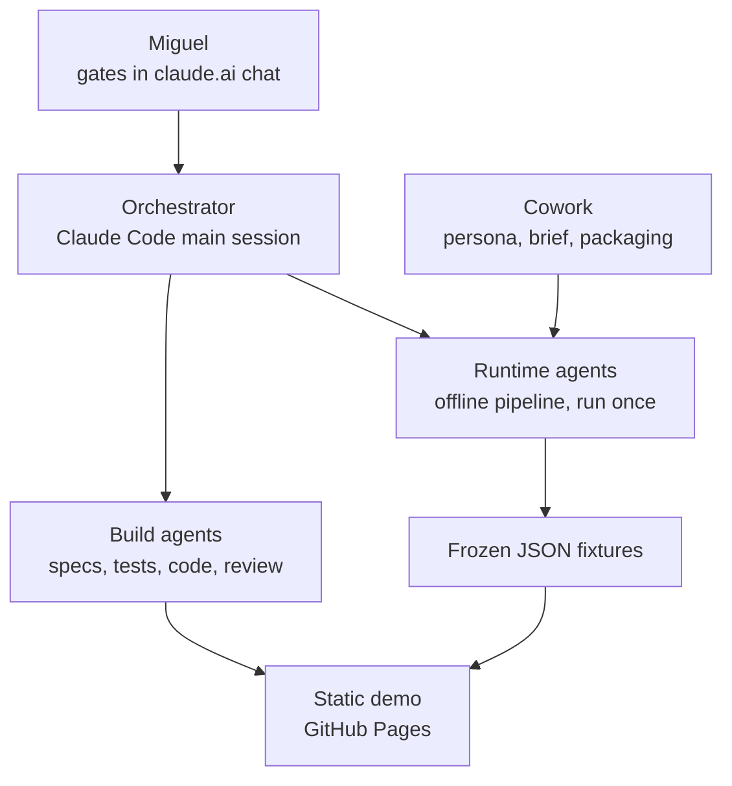

# Level 3 — Architecture

**Status: to be authored by the Architect. Gate: G2.**

## Given (from the approved build plan)

Three layers:

1. **Build agents** — write specifications, tests and code. Claude Code subagents.
2. **Runtime agents** — run the content pipeline **once, offline**, before G3. Their output is
   frozen into the demo. They never run for a viewer.
3. **Static presentation layer** — vanilla HTML, CSS and JS, served from GitHub Pages.

## Data contracts — to be defined here

`Signal`, `Trend`, `Reading`, `Interrogation`, `Judgement`, `ReadinessProfile`, `LogEntry`.

Every runtime agent writes to these schemas and the UI reads only from them. `Judgement` and
`LogEntry` carry an **optional `role` field** — that is how R7 is designed for without being built.

Constraints on the contracts:

- No `score`, `rank`, `confidence` or `priority` field on any entity. A `Trend` holds exactly three
  `Reading`s, unordered peers, distinguished only by `lens` (`opportunity` | `threat` | `noise`).
- Every `Reading` carries evidence, counter-evidence and a `disconfirmingCondition`.
- Every entity carries a `provenance` block (source URL, publication date, retrieval date) and a
  `label` from the honesty vocabulary: `real` | `ai-generated` | `frozen` | `fictional` | `replay`.
- `Judgement` cannot be valid without a `rationale` and a preceding `intuition` record.

Author them as JSON Schema files in `schemas/`, one per entity, plus a short prose rationale here
explaining each field a reviewer would question.

## Also to be decided here

- The shipped form of frozen content: ES modules in `data/` (`export default {...}`), generated
  from the raw JSON in `pipeline/output/`. Describe the freeze step and who runs it.
- Module boundaries and the dependency direction between M1–M10.
- How state within a viewer session is held without persistence (the demo stores nothing).
- How R7's role-awareness would be activated in a real build, in one paragraph — designed for,
  not built.
