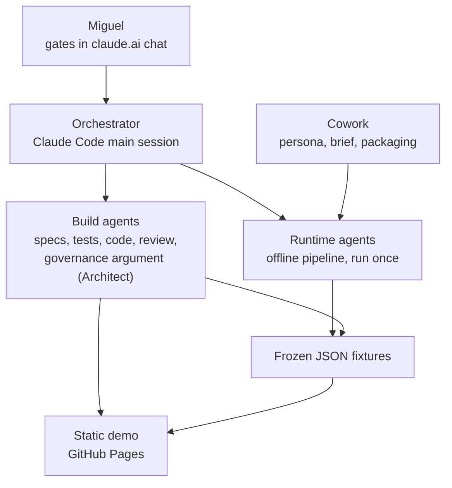
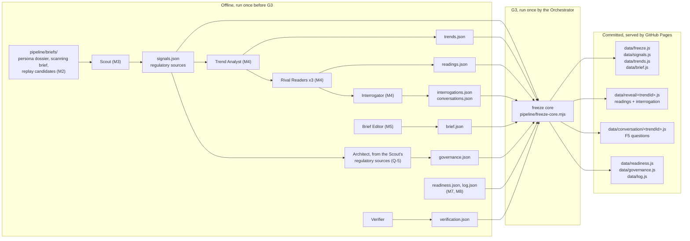
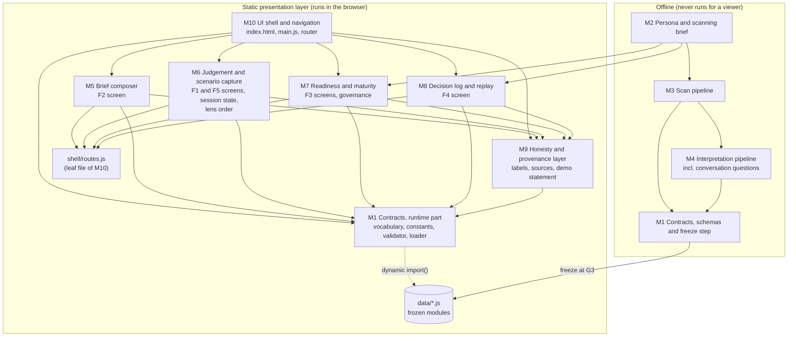

# Level 3 — Architecture

**Status: authored by the Architect on 19 September 2026; revised on 5 October 2026 to apply
Miguel's G2 decisions of 4 October 2026 (K-1 to K-7, Q-1 to Q-7, D-1, DM-1 to DM-10), the Q-5
debate outcome of 5 October 2026 and the Level 2 revision of the same day. Awaiting G2. Input:
`02-system-requirements.md`. The decisions are recorded, with their dates, in section 15; the items
that are still open are marked there and in section 14. Requests to Level 2 are in section 13.**

This document says how Periscope is put together: the layers, how content travels from an offline
pipeline into a static page, what the data contracts are and why each field exists, how the page
keeps the founder's own step ahead of the machine's, and which part of the code may depend on
which. It is written so that a reviewer can check every design choice against the five invariants
in `CLAUDE.md` without reading any code.

## Contents

1. The shape of the system in one paragraph
2. Layers
3. How content travels: pipeline, verification, freeze, page
4. The freeze step
5. Data contracts
6. Runtime design: loading, validation and the two gates
7. Session state, screen addressing and the random order of the readings
8. Honesty labels in the page
9. What `file://` can and cannot promise
10. Module boundaries and dependency direction
11. Role-awareness (R7): how it would be activated
12. Answers to A-1 to A-14
13. Changes requested to Level 2
14. Follow-ups and open items for the Orchestrator
15. Record of decisions

---

## 1. The shape of the system in one paragraph

Periscope is a static web page with no server logic and no runtime AI. All content was produced
once, offline, by a pipeline of agents; it was verified claim by claim, then frozen into plain
JavaScript data files that the page imports. The page lets a viewer read a weekly brief, open a
trend, record a gut reading, and only then see three rival readings side by side, in an order drawn
at random, answer questions about them and commit a judgement with a written rationale. After
committing, the viewer can write what they have heard in their own conversations and how the trend
could play out, and only then see questions to take into their next conversations. Everything the
viewer types lives in the memory of one browser tab, carries the label `yours`, and disappears on
reload. The architecture's job is to make the invariants structural rather than a matter of care: a
reading cannot be ranked because no contract has anywhere to put a rank and no list order is taken
from the data; a reading cannot leak before the gut reading because its file is not loaded until
then; a judgement cannot be committed without a rationale because the contract, the validator and
the button all refuse it.

## 2. Layers

Three layers, as given in the approved build plan.

1. **Build agents** write specifications, tests and code. They are Claude Code subagents working
   inside the V-Model gates. One build agent also writes content: the Architect drafts the
   governance argument during G3 from the Scout's frozen source list (Q-5 outcome, section 5.5).
2. **Runtime agents** run the content pipeline **once, offline**, before G3: Scout, Trend Analyst,
   three Rival Readers, Interrogator, Verifier, Brief Editor. Their output is frozen into the demo.
   They never run for a viewer.
3. **Static presentation layer**: vanilla HTML, CSS and JavaScript, served by GitHub Pages from the
   repository root. It reads only the frozen data modules in `data/`.



The boundary that matters most runs between the second and third layers. Nothing on the
presentation side can call back into the pipeline: there is no network client in the page, no
API key, and no endpoint to call. The only thing that crosses the boundary is a set of files
committed to the repository at G3.

## 3. How content travels: pipeline, verification, freeze, page



The raw pipeline output in `pipeline/output/` is JSON, one file per entity type, because that is
what agents write most reliably and what the Verifier reads most easily. The shipped form in
`data/` is ES modules (`export default {...}`), because the page may not `fetch()` anything and an
ES module is the only way a static page can import structured content with no network request of
its own making. The freeze step is the one translation between the two.

Three differences between the raw and shipped layouts are deliberate:

- **Readings and interrogations are regrouped by trend.** In `pipeline/output/` they are flat
  lists, which suits the agents. In `data/` each trend gets its own reveal bundle,
  `data/reveal/<trendId>.js`, holding exactly its three Readings and its Interrogation. That is
  what lets the page load one trend's readings, and only that trend's, at the moment the viewer
  records a gut reading (section 6.3).
- **Conversation questions are split out by trend as well.** `conversations.json` becomes one
  module per trend, `data/conversation/<trendId>.js`, loaded only after the viewer has recorded
  their own scenario in F5 (section 6.4).
- **A freeze manifest is added.** `data/freeze.js` records the freeze date and the list of modules
  written. The demo-wide statement on every screen needs the freeze date before any content module
  has loaded, and the list tells the page whether F5's questions exist in this build.

No text is changed in the translation. The freeze step wraps and regroups; it never edits.

**The governance argument (Q-5 outcome, 5 October 2026, pending Miguel's confirmation at G2).** The
Scout gathers the regulatory sources in the same offline run as the signals, and they are frozen
as a source list in `pipeline/output/`. During G3 the Architect drafts the argument from that list
only: it has no web tools and needs none, and any sentence it cannot tie to a listed source is cut.
The Verifier then checks every paragraph against an opened, dated source, or strikes it. The
schedule, the one-paragraph fallback and the go or no-go rule are recorded in `gates.md`. Miguel
does not write the argument; he accepts or strikes it at G3 and records his reason.

## 4. The freeze step

**What it is.** A pure function and two thin drivers. The function,
`pipeline/freeze-core.mjs`, takes the parsed contents of `pipeline/output/`, the verification
record and the schemas, and returns either the complete set of `data/` files as text or a list of
errors. It performs no input or output of its own, so it runs identically under Node and in a
browser, and it is unit-tested with in-memory inputs. It uses only language built-ins and the Web
Crypto API (`crypto.subtle.digest('SHA-256', …)`), which Node 22 and every current browser provide
under the same name, and the project's own schema interpreter (section 6.2).

- `pipeline/freeze.mjs` is the Node driver (Node 22.7 or later): it reads the files, calls the
  core, and writes `data/` only if the core succeeded, all at once; on failure it writes nothing,
  prints every error (each naming the entity's identifier) and exits non-zero.
- `pipeline/freeze.html` is the browser driver, for a build machine without Node (section 14,
  F-9). Opened from a local static server or from the published site, it loads the same JSON files
  with ES import attributes (`import(path, { with: { type: 'json' } })`), so it makes no `fetch()`
  and needs no decision under DM-11; it calls the same core, shows any errors, and otherwise offers
  each output file for download, to be placed in `data/` unchanged. It is offline tooling, never
  linked from the demo.

**The core's interface.** This adopts the provisional interface the Test Engineer wrote M1-U11 and
M1-U13 against, which is sound.

```js
freeze({ inputs, verification, schemas, frozenOn, pipelineRunOn })
  // resolves to { ok: true, files } or { ok: false, errors }; never throws
```

- `inputs`: an object keyed by the `pipeline/output/` file name, each value the parsed JSON:
  `signals.json`, `trends.json`, `readings.json`, `interrogations.json` and `log.json` (arrays),
  `conversations.json` (an array, possibly empty), `brief.json`, `readiness.json` and
  `governance.json` (objects).
- `verification`: the parsed `verification.json`, `{ entities: [{ type, id, hash, verdict, note }] }`
  (F-3). An entity is matched to its verdict by `id`; identifiers are unique across types because
  each type has its own prefix (`sig-`, `trend-`, `reading-`, `interrogation-`, `conversation-`,
  `replay-`, `brief-`, `readiness-`, and the literal `governance`).
- `schemas`: an object from schema file name to parsed schema, as `tests/lib/schemas.mjs` exports.
- `frozenOn`, `pipelineRunOn`: ISO dates written into the manifest and the header line.
- `files`: a `Map` from repository path (`data/…`) to file text. `errors`: an array of messages,
  each naming the identifier of the entity concerned.

**Order in the output.** Arrays keep their input order: `data/signals.js`, `data/trends.js` and
`data/log.js` in the order of their input files; each reveal bundle holds its trend's readings in
`readings.json` order. This order carries no meaning, because the page imposes its own orders
(C-4), and keeping it makes the output a pure function of the input. The manifest's `modules` are
sorted by code point and include `data/freeze.js` itself. Conversation modules are written only if
`conversations.json` has entries, one per trend; partial coverage fails M1-U9.

**The driver's command line.** From the repository root: `node pipeline/freeze.mjs`, reading
`pipeline/output/` and writing `data/`. Two optional flags, `--frozen-on YYYY-MM-DD` and
`--pipeline-run-on YYYY-MM-DD`, set the dates; without them, `frozenOn` is the current UTC date and
`pipelineRunOn` is the latest `provenance.producedOn` among the input entities. At G3 the
Orchestrator passes both flags explicitly, so a later re-run with the same flags reproduces `data/`
byte for byte (M1-U13 passes the committed manifest's dates to the core).

**Why this is not a build step.** The stack rule forbids a build step so that the repository as
committed is exactly what GitHub Pages serves, with nothing generated between a commit and a
viewer. The freeze step honours that. It runs once, at the content-freeze gate, and its output is
committed and reviewed like any other file. Nothing runs when the site is deployed, and nothing
runs when a viewer opens it. It is a content operation with a reviewable diff, closer to exporting
a spreadsheet than to compiling code.

**Who runs it, and when.** The Orchestrator, at G3 (5 October 2026), in this order:

1. The runtime pipeline has finished, the Architect's governance draft has been through the
   Verifier, and the Verifier has written `pipeline/output/verification.json` (F-3).
2. The Orchestrator runs either driver.
3. The Orchestrator runs the M1 unit tests against the new `data/`, under `node --test` or from the
   browser runner `tests/run.html` (`04-module-design.md`, "What the Test Engineer should know").
4. The Orchestrator commits `pipeline/output/` and `data/` together, in one commit whose message
   names the G3 date, and sets `CONTENT_FROZEN` in `tests/lib/stage.mjs` in the same commit. Miguel
   decides G3 on that commit; the Red-team Reviewer reviews the same commit.

**What the freeze guarantees, and where the guarantee really lives.** The script enforces each
property below, but the guarantee is the M1 test that checks it against the committed files,
because a test holds whoever produced `data/`, including a person who places downloaded files by
hand.

- *Nothing unverified ships.* The core refuses if any entity lacks a `pass` verdict in the
  verification record, or if the SHA-256 hash of the entity's canonical JSON (keys sorted
  recursively, no whitespace, UTF-8) differs from the hash the Verifier recorded (M1-U11). From G3,
  every entity in the committed `data/` must carry such a verdict and hash (M1-U16). A claim edited
  after verification therefore cannot ship unverified. This constrains the pipeline order; see F-2.
- *Nothing fails the contracts.* It validates every entity against its schema before producing
  any output, and stops on the first failure (M1-U11).
- *No hand edits survive.* It is deterministic. Each file is exactly: the line
  `// Frozen at G3 on <frozenOn> from pipeline/output/. Generated by pipeline/freeze-core.mjs; do not edit by hand.`,
  a newline, `export default `, the value as `JSON.stringify` with recursively sorted keys and
  two-space indentation, `;`, and one trailing newline. Re-running the core on the committed
  `pipeline/output/` must reproduce `data/` byte for byte (M1-U13).
- *Data modules are inert.* Each output file contains the header comment and one `export default`
  of a plain JSON literal. Outside string literals there is no `import`, `function`, `=>`, `new`
  or backtick; inside string literals such words are prose and cannot execute (M1-U14).
- *The manifest tells the truth.* `data/freeze.js` lists exactly the module files in `data/`
  (M1-U14), and either every trend has a conversation module or none does (M1-U9). Dotfiles, such
  as `data/.gitkeep`, are repository housekeeping, not modules: the freeze never writes or lists
  them, and every check that compares a directory with a manifest ignores any path with a segment
  beginning with a dot.

## 5. Data contracts

The contracts are JSON Schema (draft 2020-12) files in `schemas/`. Seven describe the entities named
in the brief; two more describe F5's records; four describe containers that the specification or
the loading design needs; one holds shared definitions.

| File | Kind | Shipped as | Rendered as an element |
|---|---|---|---|
| `signal.schema.json` | Entity | `data/signals.js`, array | Yes |
| `trend.schema.json` | Entity | `data/trends.js`, array | Yes |
| `reading.schema.json` | Entity | inside `data/reveal/<trendId>.js` | Yes |
| `interrogation.schema.json` | Entity | inside `data/reveal/<trendId>.js` | Yes |
| `judgement.schema.json` | Entity, in-session | never shipped; created in the tab | Yes |
| `readiness-profile.schema.json` | Entity | `data/readiness.js` | Yes |
| `log-entry.schema.json` | Entity | `data/log.js`, array | Yes |
| `conversation-questions.schema.json` | Entity (F5, A-11) | `data/conversation/<trendId>.js` | Yes |
| `scenario-record.schema.json` | Entity, in-session (F5, A-11) | never shipped; created in the tab | Yes |
| `brief.schema.json` | Container (A-2) | `data/brief.js` | Yes, as the brief header |
| `governance.schema.json` | Container (A-2) | `data/governance.js` | Yes, as the governance screen |
| `reveal-bundle.schema.json` | Shipping container | `data/reveal/<trendId>.js` | No |
| `freeze-manifest.schema.json` | Shipping container | `data/freeze.js` | No |
| `common.schema.json` | Shared definitions | — | — |

### 5.1 Rules that hold across every contract

**Every object is closed.** Every object schema sets `additionalProperties: false`. A field that is
not in the contract cannot be added by an agent, at any depth, without the fixture failing
validation. This is the first line of defence against a `score` or `rank` creeping in.

**There are no numbers, integers or booleans anywhere.** No schema declares `type: number`,
`integer` or `boolean`. This is stronger than banning four field names: it removes the only data
types in which a score, weight, likelihood, probability, rank position, rating or "featured" flag
could be carried at all. Counts that the UI needs (how many signals were withheld) are computed at
runtime, never stored. The one place a digit string is stored on purpose is a report's page number,
which locates a claim and orders nothing (section 5.4). The M1 unit tests check this rule and a
banned-name list that covers the four names in the invariant plus their near synonyms.

**Enumerations are allowlisted.** A text enumeration can carry a ranking as easily as a number can
("high", "medium", "low"). The schemas use exactly six enumerations: the honesty label, the lens,
the producer (and one subset of it, the authors of a replay judgement), the maturity verification
status, the readiness category key and the foresight practice key. None of them is ordinal: the
practice and category orders are their sources' orders, and nothing is placed above anything else.
A unit test fails if any other enumeration appears (M1-U5).

**Decided values have one home.** The constants Miguel fixed on 4 October 2026 (DM-9) live in
`assets/js/contracts/constants.js`. Where a schema must repeat one of them as a bound (the brief's
`maxItems` of 5, the question groups' `maxItems` of 3), M1-U5 fails if the two differ.

**Identifiers cannot encode an order.** Identifiers are built from dates and word slugs, and every
slug segment must begin with a letter: `sig-2026-02-11-otel-profiling`,
`trend-open-telemetry-profiling`, `reading-open-telemetry-profiling-noise`. An identifier such as
`trend-1` is rejected by the pattern. Without this rule a sequence number, assigned by an agent in
the order it thought most important, would silently survive into a tie-break (C-4 breaks ties by
identifier).

**Every factual claim carries its own dated source.** The unit of sourcing is the claim, not the
entity. A `sourceRef` (URL, publisher, optional title, publication date, retrieval date) is attached
to each evidence item, each counter-evidence item, each replay signal, each replay outcome, each
governance argument paragraph and the framework citations. Where a claim rests on a particular page
of a report, a `reportCitation` adds the title and the page.

**Every entity carries `provenance` and `label`.** How these two work is the part of the design a
reviewer is most likely to question, so it is set out in full below.

### 5.2 Provenance: why some source fields are null (DM-3, ratified 4 October 2026)

The brief for these contracts asks that every entity carry a provenance block with a source URL,
a publication date and a retrieval date. Read literally, that cannot be honest for an entity that
was generated rather than published. A Trend has no URL: it is a synthesis written by the Trend
Analyst, resting on several signals, each with its own URL. Inventing a URL for it, or copying one
signal's URL onto it, would misrepresent where it came from.

So every entity carries the same provenance block, with the same seven keys, and the block says
one of two things:

- **This entity is itself a published item.** `sourceUrl`, `publisher`, `publishedOn` and
  `retrievedOn` are set. This applies to Signals, where the schema requires it
  (`publishedProvenance`).
- **This entity was generated or authored.** The same four fields are `null`, and the claims
  inside it carry their own `sourceRef`. The schema enforces that the four fields are either all
  set or all null, so a half-sourced entity cannot exist.

The remaining three keys say who produced the entity and when: `producedBy` (one or more of the
pipeline agents, the Architect for the governance argument, the Cowork persona researcher, a named
human author, or the viewer), `producedOn`, and `frozenOn` (the G3 date). Fixture entities must have
a `frozenOn` and may never name the viewer as producer. The viewer's Judgement and ScenarioRecord
must have `frozenOn: null`, `producedBy: ["viewer"]` and no external source.

This satisfies invariant 4 ("every factual claim is sourced") exactly, and the provenance
constraint in its intent while making it honest. Miguel ratified it on 4 October 2026 (DM-3).

### 5.3 Labels (DM-1 and DM-2, decided 4 October 2026)

The vocabulary has six values: `real`, `ai-generated`, `frozen`, `fictional`, `replay` and `yours`.
`yours` was added by DM-1 for text and choices the viewer enters. DM-2 fixed the semantics, and the
contracts now encode them instead of leaving room for either reading:

1. **The element label states origin.** `real` marks a published, verifiable item, or a statement
   about the demo that a named test verifies. `ai-generated` marks text written offline by an
   agent. `fictional` marks content about the invented Tracewell team. `replay` marks the decision
   log's entries and the past judgements in them. `yours` marks what the viewer enters in this tab.
2. **`frozen` is demo-wide.** Every fixture is frozen, and the demo-wide statement on every screen
   says so once, using `data/freeze.js`. `frozen` is an element label only for an assembled
   container whose parts carry their own labels: in this build, the weekly brief and nothing else.
3. **Composite items carry per-part labels.** A part whose origin differs from its entity carries
   its own label, through the shared shape `generatedText` (`{ text, label: "ai-generated" }`);
   any other part is covered by the entity's label.
4. **Peers carry identical labels,** which the contracts guarantee by fixing each peer's label.

Because the semantics are now decided, every label in the contracts is a constant except the
vocabulary itself:

| Entity or part | Label | Fixed by |
|---|---|---|
| Signal; replay signal; replay outcome; readiness framework citation | `real` | `const` |
| Signal summary and relevance note; replay signal summary; outcome summary; calibration note (DM-10); next-level description | `ai-generated` | `generatedText` |
| Trend, Reading, Interrogation, ConversationQuestions | `ai-generated` | `generatedLabel` (now a `const`) |
| Governance container, covering both lists | `real` | `const` |
| Governance argument paragraph (Q-5) | `ai-generated` | `const`, required on every item |
| ReadinessProfile, covering answers, findings, level assignments and explanations | `fictional` | `const` |
| LogEntry; past judgement | `replay` | `const` |
| Brief | `frozen` | `const` |
| Judgement; ScenarioRecord | `yours` | `const` |

Tracewell's name, wherever it appears as content, is shown as `fictional` by the screen that
renders it; this is a rendering rule (M9), not a field.

### 5.4 Entity by entity: the fields a reviewer would question

**Signal.** One real, dated, published item.

- *No `trendIds` field.* The contracts put the signal-to-trend link on one side only, the Trend
  (`signalIds`), because the Trend Analyst is the agent who creates the relation; the Scout, who
  writes signals, does not know the trends yet. Holding the link on both sides would let them
  disagree. The UI inverts `Trend.signalIds` at load time to draw the links in F2 (A-3).
- *`summary` and `relevanceNote` are `generatedText`,* because they are written by the pipeline
  while the signal is real. Each shows its own `ai-generated` label.
- *`quote` has no length in the schema.* `QUOTE_MAX_WORDS` (15) lives in `constants.js` and is
  enforced by M3-U4 and by `renderQuote`, so the value has one home.
- *`sourceLanguage`* records whether the source is English or German, for the `lang` attribute
  (accessibility) and for the German-coverage record in NF6.
- *`windowNote`* exists because the Scout's brief says a source outside the scanning window must
  be flagged, not hidden.

**Trend.** A cluster of signals, lens-neutral, shown before the gut reading.

- *`readings` holds three references, not three readings.* Each reference is `{ lens, readingId }`
  and nothing else. This is how the Trend "holds exactly three Readings" without putting any
  reading text into a file that loads before the intuition record. `minItems: 3`, `maxItems: 3`
  and, for each lens, a `contains` / `minContains: 1` / `maxContains: 1` clause force exactly one
  opportunity, one threat and one noise reference. That each reference points at a real Reading
  with the same trend and lens is the referential-integrity test, M1-U9.
- *Array order carries no meaning, and the page proves it.* The readings are unordered peers. The
  page ignores array order and shows them in an order drawn at random per trend per page load
  (Q-2, section 7.3).
- *`intuitionPrompt` sits on the Trend,* not the Interrogation. It is the only question the viewer
  sees before the readings, so it must load with the Trend; the rest of the Interrogation loads
  afterwards (A-4). The Trend's provenance therefore names two producers, `trend-analyst` and
  `interrogator`.
- *No momentum or strength field.* How strongly the signals support the movement is prose in
  `summary`, subject to the language rule C-6; a separate strength field would be a rating by
  another name.

**Reading.** One rival reading through one lens.

- *Identity is trend plus lens, nothing else.* No strength, likelihood, confidence or position.
- *`evidence` and `counterEvidence` have the same shape* and the same minimum (at least one item
  each, each with a dated source). The case against a reading is not a lesser kind of content, and
  the contract does not let it be thinner.
- *`disconfirmingCondition` is required prose.* Whether it is observable and checkable is a
  content question for the Verifier and Red-team; the contract guarantees it is there.
- *`signalId` on a claim is optional,* to let the Verifier cross-check a claim that draws on a
  signal, without forcing every piece of evidence to come from the brief.

**Interrogation.** The questioning layer for one trend.

- *Per trend, not per reading (A-4).* Attaching assumption probes to individual readings would let
  one lens receive more questioning than another, which is a quiet form of emphasis.
- *Three groups of one to three questions each.* DM-9 fixed three questions per group, and the
  pre-mortem became a group like the other two (it was a single question). The cap protects the
  eight-minute core loop (NF4).
- *Every question must end with a question mark.* The Interrogator's rule is "questions, not
  advice"; the pattern makes a stray recommendation phrased as a statement fail validation.
- *Each question has an `id`,* unique across all interrogations and conversation-question sets, so
  that the viewer's optional answers and notes can refer to it.

**Judgement.** The viewer's own record, created in the tab, never stored.

- *The intuition record is embedded and required.* `intuition` holds `gutCall` (a lens), `reason`
  (one line, or null) and `recordedAt`. A Judgement without it fails validation. Between the gut
  reading and the commit, session state holds the intuition record on its own; at commit, the same
  frozen object is embedded unchanged (A-1).
- *Three timestamps make "preceding" checkable.* `intuition.recordedAt ≤ readingsRevealedAt ≤
  committedAt`, ISO instants from the browser clock. JSON Schema cannot compare two values, so the
  runtime validator `checkJudgement` checks the order (M1-U10, M6-U13).
- *`committedLens` and `gutCall` are separate fields that are never compared.* The demo does not
  evaluate the viewer (F1 rules).
- *`rationale` requires at least one non-whitespace character* and nothing more. There is no
  minimum length, because a minimum would be a grade.
- *`label` is the constant `yours`* (DM-1); every part of a Judgement is the viewer's.
- *`role` is optional* (R7, section 11).
- *Replay judgements are not Judgements.* They have no genuine intuition record, and inventing one
  would be a fabrication. They are modelled inside LogEntry.

**ReadinessProfile.** Tracewell's position on the five Jöhnk et al. (2021) categories, and a
maturity level for each foresight practice (A-10, A-13).

- *No numbers.* A category holds answers (question and answer pairs from the persona dossier) and a
  prose `finding`. There is no score, no bar value, no traffic-light enumeration. M7-U3 checks that
  the screen renders no meter, progress bar or width-scaled element either.
- *The five categories are forced by key* (DM-8: strategic alignment, resources, knowledge, culture,
  data, confirmed by the thesis). Here array order is meaningful, and the schema says so: it is the
  order in which the paper presents the categories (C-4), never an order of findings.
- *One maturity entry per practice, not one per venture (D-1).* `maturity.practices` holds exactly
  three entries, keyed `scanning`, `trend-analysis` and `scenario-work`, in the order R2 names the
  methods. Whether those are the right three is open item O-3 (section 14).
- *A level is a name, never a number.* Storing "level 2 of 3" would put an ordinal scale into the
  data. Each practice holds `levelName` only.
- *`betweenLevels` makes the lower-level rule checkable.* When Tracewell's account of a practice
  falls between two levels, the thesis assigns the lower one, and so does F3. The entry then records
  both names, `lowerLevelName` and `upperLevelName`; the validator requires `lowerLevelName` to
  equal `levelName` and `upperLevelName` to be the level the report places directly above it
  (M1-U20). Without the field, "we applied the lower-level rule" would be an unverifiable sentence
  in the explanation. When the account does not fall between two levels, the field is an explicit
  `null`.
- *`nextLevel` is no longer pinned to null (K-2, A-13).* For each practice it holds either the next
  level's name, the report's description of it (paraphrased, `generatedText`, so labelled
  `ai-generated`) and a page citation; or, where the assigned level is the highest the report
  describes, only `noLevelAboveCitation`, and the page renders the fixed sentence "The report
  describes no level above this one." The two cases are disjoint closed shapes, so no flag is
  needed to tell them apart. The description is the report's, never the demo's advice; its six
  wording constraints from Level 2 are tested by M7-U9.
- *The placeholder is enforced by the schema.* While `maturity.status` is `unverified`, every
  practice's `levelName` must be the literal `LEVEL_NAME_UNVERIFIED`, and `betweenLevels`,
  `explanation`, `nextLevel` and the report citation must be null. Only once `status` is `verified`
  may anything else appear. Only Miguel changes `status`, after the Verifier has re-opened p. 9.
- *Swapping the placeholder for the verified names is a one-place change.* No schema enumerates the
  level names, and no level name exists anywhere in `assets/`, `index.html` or `schemas/`. The names'
  only home in code is `MATURITY_LEVEL_NAMES` in `assets/js/contracts/vocabulary.js`, an empty
  frozen array until verification. On verification the Orchestrator writes the verified names into
  that one array, in the order the report presents them; the readiness content is written with
  `status: "verified"` and frozen through the normal path. The validator and M7 read the names from
  that array, and M1-U18 fails if any candidate level name appears anywhere else in the shipped
  code or the schemas. The array's order is the report's structure, used only to check "lower" and
  "next"; it is never rendered as a scale, a number or a bar.
- *Citations carry a page as text.* `reportCitation` requires the report's title and a `page` such
  as `"9"`. The page is a string so that the no-number rule holds without exception.

**LogEntry.** One retrospective replay entry (K-7, DM-10).

- *Composite, with per-part labels.* The entry and its past judgement are `replay`; each original
  signal and the outcome are `real`; every paraphrase inside them and the calibration note are
  `ai-generated`.
- *`asOfDate`, `authoredOn`, `authoredBy` and `outcome.attachedOn` record K-7 in the data.* The
  past judgement is presented as of early 2026, but it was written on `authoredOn` by the agents in
  `authoredBy` (the Rival Readers and the Interrogator), from the original signals only, and the
  Verifier attached the outcome afterwards, on `attachedOn`. M8-U7 checks `asOfDate ≤ authoredOn ≤
  attachedOn ≤ frozenOn`, as well as `asOfDate` falling on or after the latest signal and before the
  outcome's publication. The replay statement and each entry state who wrote the judgement and
  when, from these fields.
- *No verdict field.* There is no `held: true`, no hit or miss enumeration, nothing that could be
  tallied into a hit rate. That at least one judgement did not hold is a review check at G3, not a
  data check.
- *Replay signals are embedded, not referenced.* They come from the replay window (1 January to
  31 March 2026, DM-9) and have no relevance note, so they are not `Signal` entities.
- *`role` is optional,* on the entry, as the constraint specifies (R7).

**ConversationQuestions** (F5, A-11). For one trend, one to three questions, each ending with a
question mark, labelled `ai-generated`, written by the Interrogator in the same offline run.
There is deliberately no scenario text from the machine: the founder writes the scenario, and the
machine supplies only questions to take into the next conversations, so there is nothing to rank
and nothing to choose between. It ships in its own per-trend module, for the reason given in
section 6.4.

**ScenarioRecord** (F5, A-11). The viewer's own entry: `whatWasHeard`, `howItCouldPlayOut`,
`recordedAt`, optional `questionNotes`, label `yours`, session provenance. A contract is needed,
not merely convenient: it is how the tests prove that the record is the viewer's alone and that it
was made after the committed judgement. `checkScenarioRecord(record, judgement)` requires both
fields to hold a non-whitespace character and `recordedAt` to be later than the Judgement's
`committedAt`. The two fields are locked once recorded; the notes stay editable while the screen is
open, so session state holds them apart and snapshots them into this shape for validation.

### 5.5 Containers (A-2)

**Brief.** It holds one weekly brief: its period, its freeze date and its signals. It is a schema
rather than a plain data module because it is rendered (the brief header shows the period and the
freeze date) and so must carry a label, and because an unvalidated module would be the one place
where a "featured" signal identifier could slip through. It holds signal identifiers, not signals,
so each signal's text exists in exactly one place, and the order of the identifiers carries no
meaning, so the Brief Editor cannot express a preference through position. `maxItems` is 5, equal
to `BRIEF_SIGNAL_CAP`, which DM-9 defines as a maximum; zero signals is valid and gives `F2-S0`.

**Governance.** The governance screen's content is a schema because R8's acceptance depends on it
and because it makes regulatory claims that must be sourced. The seven statements Level 2 requires
(four implemented, three not) are pinned by identifier, so the screen cannot ship without them.
Every "implemented" statement names the tests that verify it (`verifiedBy`), which is why the
container, and with it both lists, is labelled `real` under DM-2. Every paragraph of the argument
carries at least one dated source and, since the Q-5 outcome, a required `label` fixed to
`ai-generated`, because the Architect drafts it. The argument's paragraphs are in reading order:
this is one continuous argument, not a list of peers. M1-U17 checks the labels.

**RevealBundle** and **FreezeManifest** are shipping containers, not content. They are never
rendered as elements of their own, so they carry no label or provenance; the entities inside them
do.

## 6. Runtime design: loading, validation and the two gates

### 6.1 Loading: every data module through one gate

No application code imports anything from `data/` with a static `import` statement. All data is
loaded through the M1 loader (`assets/js/contracts/load.js`), which uses dynamic `import()` with a
fixed, literal module path for each top-level data module, validates what it receives, deep-freezes
it and memoises it for the rest of the session. `createLoader({ importer, levelNames })` returns
the loader functions (`levelNames` lets a test validate a verified readiness fixture against
synthetic level names); the page uses the default importer (`(path) => import(path)`), and tests inject one that
maps paths to fixture modules or records calls.

A static import that fails (a missing file, a syntax error) takes down the whole module graph, so
one bad data file would blank the entire demo. A dynamic import fails alone: the loader returns a
typed failure, and the one screen that needed that data shows its own error state (`F1-E0`,
`F2-E1`, `F3-E1`, `F3-E2`, `F4-E1`), while every other screen keeps working (A-5).

Start-up needs only one data module, `data/freeze.js`. If it fails, or if any script fails before
the shell is ready, the static `G-E1` message stays up. That message is plain HTML in `index.html`,
visible by default and removed by script only after a successful start, so it also appears when
JavaScript is disabled or when a browser refuses to load module scripts at all (section 9).

### 6.2 Validation in the browser, with no dependencies (A-5)

The browser cannot use a JSON Schema library: there is no package manager to install one and no
CDN to load one from. The design has two validators with deliberately different jobs.

- **At test time and at freeze time: the full contracts.** A small JSON Schema interpreter written
  for this project lives in `tests/lib/mini-schema.mjs`. It supports only the keywords these schemas
  use (`type`, `properties`, `required`, `additionalProperties`, `items`, `minItems`, `maxItems`,
  `uniqueItems`, `contains`, `minContains`, `maxContains`, `enum`, `const`, `pattern`, `minLength`,
  `maxLength`, `allOf`, `oneOf`, `not`, `if`/`then`/`else`, `$ref`, `$defs`, and the annotations
  `$schema`, `$id`, `title`, `description`). It throws on any keyword it does not know, so a schema
  can never quietly use a rule that nothing enforces (M1-U7). The interpreter is tooling, used by
  the tests and the freeze drivers, and never ships to the page.
- **In the browser: the invariant-guarding checks.** `assets/js/contracts/validate.js` is a
  hand-written set of check functions, one per entity and container, including the freeze manifest
  (`checkFreezeManifest`); their signatures are fixed in `04-module-design.md`, M1. It implements the structural checks Level 2 lists in each
  flow's preconditions, plus a deep scan for banned field names at any depth, plus the rules JSON
  Schema cannot express (timestamp order, membership in `MATURITY_LEVEL_NAMES`). It is a deliberate
  subset of the schemas plus those extras: its job is to guard the invariants at the point of
  rendering, not to re-prove what the tests already proved.

**How the two are kept in step.** Three mechanisms, all tested:

1. *One source for the vocabulary.* The label values and their display forms, lens values, producer
   values, practice and category keys, banned name tokens, identifier patterns, the level-name
   placeholder and `MATURITY_LEVEL_NAMES` are defined once, in `assets/js/contracts/vocabulary.js`.
   M1-U5 asserts that every enumeration and pattern in the schemas equals the corresponding
   constant.
2. *Mutation agreement.* M1-U6 takes a valid sample of every entity and generates mutants. Every
   mutant in an invariant-guarding class must be rejected by **both** the schema interpreter and the
   runtime validator. The few rules only the validator can express (timestamp order, level-name
   membership) have their own tests (M1-U10, M1-U19, M1-U20).
3. *A change rule.* A change to any schema must come with a change to `validate.js` and to the
   mutant list, or with a sentence in the commit message saying why neither is needed. The Red-team
   Reviewer checks this at each gate.

**Which checks run in the browser**, by flow:

| Flow | Checked in the browser before rendering | On failure |
|---|---|---|
| F1, trend list | The module loads and is an array | `F1-E0` |
| F1, trend record | Exactly three reading references, one per lens; non-empty title, summary and intuition prompt; every `signalId` resolves; label in vocabulary; no banned field at any depth | `F1-E2`, whole trend withheld |
| F1, reveal bundle | Exactly three Readings whose lenses and identifiers match the Trend's references; each with non-empty text, at least one evidence and one counter-evidence item with dated sources, and a disconfirming condition; an Interrogation with one to three questions per group, each ending with "?"; labels; no banned field | `F1-E3` |
| F1, judgement | Intuition present; order of the three timestamps; committed lens; rationale with a non-whitespace character; label `yours` | Commit refused |
| F2 | Per signal: URL, publisher, both dates, summary, relevance note, label; quote within `QUOTE_MAX_WORDS`; brief container shape and count within `BRIEF_SIGNAL_CAP` | `F2-W1` per signal, `F2-E1` for the brief |
| F3 | Five categories, each with answers and a finding; three practices; the placeholder rule while unverified; once verified, level names in `MATURITY_LEVEL_NAMES`, the lower-level rule, the next-level rule; governance container shape and argument labels | `F3-E1`, `F3-E2` |
| F4 | Per entry: signal dates in the replay window, outcome source dated after the signals, the K-7 date order, non-empty rationale and calibration note, labels | `F4-W1` per entry, `F4-E1` for the log |
| F5, questions | One to three questions, each non-empty and ending with "?"; `trendId` matches; label in vocabulary; no banned field | `F5-E2` |
| F5, scenario record | Both fields hold a non-whitespace character; `recordedAt` later than the Judgement's `committedAt`; label `yours` | Record refused |

### 6.3 Readings stay out of the page until the intuition is recorded (DM-4, ratified 4 October 2026)

Invariant audit 2 in the test plan says no AI reading may be reachable "in the DOM *or in module
state*" before the intuition step is recorded. If reading content shipped in `data/trends.js` and
was imported at start-up, its text would sit in the page's memory from the first moment, hidden
but present.

**The mechanism.** Reading content ships only in the per-trend reveal bundles,
`data/reveal/<trendId>.js`. Nothing imports a reveal bundle statically, and nothing preloads one
(no `<link rel="modulepreload">`, no prefetch). The only code path that loads one is
`loadReveal(trendId)` in the M1 loader, and the only caller of `loadReveal` is M6's
"Record my gut reading" handler, after the intuition record has been written and frozen. The
sequence is:

1. `F1-S1`: the page holds the Trend (title, summary, signals, intuition prompt, and three lens
   names with reading identifiers, which are not reading content) and the trend's drawn lens order,
   and nothing else about the trend.
2. The viewer chooses a gut call and activates "Record my gut reading".
3. M6 writes the intuition record into session state, freezes it, and disables the gut-reading
   controls.
4. M6 calls `loadReveal(trendId)`, which dynamically imports that trend's bundle and validates it.
5. M6 stamps `readingsRevealedAt` and creates the reading elements in the trend's lens order
   (`F1-S2`), or shows `F1-E3` if validation failed.

Before step 4 the reading text is not in the DOM, not in any JavaScript object, and not in the
browser's module map, because the module has never been requested. The audit's wording therefore
holds literally and does not need narrowing.

**Why this is honest, and what it does not claim.** The reveal bundles are public files on a
public website. A determined viewer could open `data/reveal/<trendId>.js` directly or read the
repository on GitHub. That is not a breach of the invariant: the invariant is about what the
*demo* reveals and in what order, not about secrecy. The architecture makes the demo's own path
incapable of showing a reading early; it does not, and need not, stop someone from reading the
source.

**Per trend, not all at once.** Recording a gut reading on one trend loads that trend's readings
only. Another trend's readings stay unloaded until its own intuition is recorded.

**How it is tested.** M6-U1 injects a spy in place of `loadReveal` and asserts it has not been
called while `F1-S1` is showing, and that the serialised DOM (including attributes, comments and
`<template>` contents) contains none of the fixture's reading strings. M6-U2 asserts that the spy
is called exactly once after the record. M10-U4 statically checks that no file other than the M1
loader mentions `data/`, and that no preload hint exists. At system level, the test reads
`performance.getEntriesByType('resource')` in `F1-S1` and requires that no `data/reveal/` entry
exists.

**The consequence for Level 2 (DM-5, accepted 4 October 2026, applied 5 October 2026).** The
browser cannot check reading content before the gut reading, because it does not yet have it. The
checks split: everything on the Trend record is checked before `F1-S1`; the reveal bundle is
checked after it loads, and if it fails the readings are withheld in `F1-E3`. The full contract of
every bundle is still proved before the demo ships (M1-U1, M1-U9), so `F1-E3` must not occur in a
shipped build.

### 6.4 The same gate for F5's conversation questions (A-11)

F5 has the same shape as F1: the founder writes first, and only then does machine content appear.
Level 2 requires that, before the scenario is recorded, the page contains no conversation question
"by the same standard as F1's rule for readings". F1's standard is not merely "not rendered"; it is
"not loaded". The questions could have travelled inside the reveal bundle, which is already loaded
by the time F5 opens; but then they would sit in module state from the moment the readings were
revealed, before the founder had written a word of their scenario. So they ship separately:

- one module per trend, `data/conversation/<trendId>.js`, holding one `ConversationQuestions`
  object;
- loaded only by `loadConversation(trendId)` in the M1 loader, which has the same guards as
  `loadReveal` (identifier pattern, membership in the trend list, injected importer);
- called only by M6's "Record my scenario" handler, after the ScenarioRecord has been written and
  its two fields locked.

M6-U20 tests it the way M6-U1 and M6-U2 test the readings. The cost is one more loader function and
one more regrouping in the freeze step; the gain is that one rule, "the founder's own step is
recorded before the machine's content is loaded", holds in both places without a qualification.

**How the page chooses between the interactive flow and the static fallback `F5-ST`.** Two
conditions must both hold for F5 to run interactively: the build switch `SCENARIO_FLOW` in
`constants.js` is `"interactive"`, and the freeze manifest lists a conversation module for every
trend. Otherwise every scenario route that passes the trend checks shows `F5-ST`, which contains no
input field and no AI-generated content. `scenarioMode(manifest, trends, flow)` in
`assets/js/state/scenario.js` decides this as a pure function (M6-U24). `SCENARIO_FLOW` starts as
`"static"`, because the conversation questions do not exist until O-1 is closed; the Orchestrator
sets it to `"interactive"` in the G3 freeze commit if the questions passed the Verifier, and sets it
back to `"static"` if the build is behind at midday on 6 October. The switch is a string, not a
boolean, so the no-boolean rule needs no exception, and it is a build setting, not content.

## 7. Session state, screen addressing and the random order of the readings

### 7.1 One in-memory object per page load (A-8)

`assets/js/state/session.js` (M6) exports `createSession({ random = Math.random } = {})`, which
returns a plain object holding a `Map` from trend identifier to that trend's progress. `main.js`
calls it once at start-up, from `start({ loader, random })`, and passes the object to the screens
that need it. It is not attached to `window` and not held in a module-level singleton, so each unit
test can create a fresh session, with its own random source.

Each trend's progress moves through these stages, in one direction only:

| Stage | Held | Screen |
|---|---|---|
| `awaiting-intuition` | The trend's lens order; draft gut call and reason (mutable) | `F1-S1` |
| `intuition-recorded` | Frozen intuition record; `readingsRevealedAt`; draft prompt answers, committed lens and rationale (mutable) | `F1-S2`, `F1-S3` |
| `committed` | Frozen Judgement | `F1-S4`; `F5-S1` with draft scenario fields (mutable) |
| `scenario-recorded` | Frozen Judgement; frozen scenario fields and `recordedAt`; question notes (mutable while the screen is open) | `F5-S2` |

Frozen here means `Object.freeze`: once recorded, the intuition record, the Judgement and the
scenario fields cannot be changed by any code path, which is how "locked read-only for the rest of
the session" is enforced below the UI.

### 7.2 Addressing screens by URL fragment (C-7, DM-7)

Screens are addressed by hash routes: `#/brief` (the entry screen, and the default when the
fragment is empty, DM-7), `#/trends`, `#/trend/<trendId>`, `#/scenario/<trendId>`, `#/readiness`,
`#/governance` and `#/log`. Any other fragment shows `G-E2`, "This page does not exist in this
build.", with a link to the brief, while the navigation and the demo-wide statement stay visible.
The scenario route is not in the main navigation; it is reached from the link on `F1-S4`.

Changing the fragment does not reload the page, so session state survives navigation, including
the browser's back and forward buttons. A trend identifier in a route is checked against the trend
list and the identifier pattern before it is ever used to build a module path, so a crafted
fragment such as `#/trend/../../x` cannot make the loader import an arbitrary file (M1-U12).

**Nothing the viewer types enters the URL.** The browser's history is a form of storage. The
fragment carries only the screen address, never a gut call, answer, rationale or scenario text
(M6-U14, M6-U25).

### 7.3 The random order of the three readings (Q-2, decided 4 October 2026)

The first time a trend card is opened in a page load, the page draws one of the six orders of the
three lenses, each equally likely, and keeps it in session state for that trend. That one order is
used for the gut-reading options, the three readings and the judgement options, every time the
trend card is shown, until the page is reloaded. The on-screen note says: "The three readings are
peers. Their order is random and means nothing."

**Where it lives and its signature.** `assets/js/state/lens-order.js`, part of M6:

```js
// random: a function returning a number in [0, 1), such as Math.random
export function drawLensOrder(random) { /* returns a frozen array of the three lenses */ }
// readings: the three Readings in any order; lensOrder: the result of drawLensOrder
export function orderReadings(readings, lensOrder) { /* returns a new frozen array */ }
```

`drawLensOrder` starts from the canonical lens list in `vocabulary.js` (`noise`, `opportunity`,
`threat`, alphabetical and meaningless) and applies a Fisher–Yates shuffle from the last position
down: for `i` = 2, then 1, `j = Math.floor(random() * (i + 1))`, and positions `i` and `j` swap.
It calls `random` exactly twice and throws a `RangeError` if a value falls outside [0, 1). With a
uniform source, each of the six orders has probability one in six. `orderReadings` returns the
readings in `lensOrder` and throws if the lenses of the readings are not exactly the three. The
session draws the order through `lensOrderFor(session, trendId)`, which calls `drawLensOrder` with
the session's `random` the first time and returns the stored order afterwards.

**How tests inject the seed.** The shipped page passes `Math.random`, and nothing in the page ever
seeds anything. Tests pass either a stub that returns a fixed sequence, or `seededRandom(seed)` from
`tests/lib/seeded-random.mjs`, a 32-bit Mulberry32 generator that is test tooling and never ships.
Because the session receives its random source when it is created, and `start()` passes its
`random` option to `createSession`, a test can fix the order at every level: the pure function
(M6-U7, node), the screen (M6-U7, browser), and the whole application (M10-U5).

**Why the order carries no meaning, and how that is proved.** The order depends on the random
source alone: not on the order of the readings in the data files, not on the trend, not on any
content. M6-U7 proves it by rendering every one of the six permutations of a bundle's readings with
the same seed and requiring identical output, and by mapping six fixed stub sequences to the six
orders, so that every order is reachable. The three reading elements use one template, so the
position is the only thing that differs, and the note tells the viewer that it means nothing.

### 7.4 Nothing is stored, including by the browser on the viewer's behalf

No code touches `localStorage`, `sessionStorage`, IndexedDB, cookies, the Cache API or a service
worker (M10-U2). Every text field sets `autocomplete="off"` so that the browser's own form history
does not keep the viewer's words either (M6-U14, M6-U25). Reloading the page discards everything,
as C-1 requires, and draws new reading orders.

## 8. Honesty labels in the page (A-7)

Every rendered content element carries its label twice. The machine-readable form is a
`data-label` attribute whose value is one of the six vocabulary words. The visible form is a short
text badge rendered by M9 next to the element. Both come from the same call, `renderLabel(value)`,
which throws for any value outside the vocabulary. Content elements are marked with `data-content`,
so a test can find every one and check both forms (M9-U1). The display forms are defined once, in
`vocabulary.js`:

| Value | Badge text |
|---|---|
| `real` | Real |
| `ai-generated` | AI-generated |
| `frozen` | Frozen |
| `fictional` | Fictional |
| `replay` | Replay |
| `yours` | Yours |

Granularity follows section 5.3: one label for each entity element, and an additional label for
each part that carries its own. Peers always carry byte-identical label markup (the three readings,
the conversation questions), so a label never distinguishes one item from its peers. The viewer's
text carries `yours` on every input field and on every read-only echo of it, in F1 and F5, which is
what makes R2's "who did what" directly visible.

**Interface copy is not content.** Headings, buttons, ordering notes, error and withheld notices,
the demo-wide statement and the replay statement carry no `data-content` and no label (M9-U8). The
demo-wide statement ("All content was produced offline and frozen on <frozenOn>; nothing in this
demo calls an AI service or the network") is rendered by M9 on every screen, using the date from
`data/freeze.js`.

## 9. What `file://` can and cannot promise (DM-6 (a), applied 4 October 2026)

`CLAUDE.md` now says: the demo works from GitHub Pages or any local static server; from `file://`
only in browsers that permit module scripts there (Firefox), and elsewhere it shows a clear message
and stops. This section explains why, and what the integration test establishes.

**What is true.** The demo makes no network request of its own, so it needs no server logic, no
API and no internet connection. It works from GitHub Pages, and from any local static web server,
in every current browser.

**What is not true.** Opening `index.html` directly from disk does not work in every browser.
Chromium-based browsers (Chrome, Edge, Brave, Opera) refuse to load ES module scripts from
`file://` URLs, because module scripts are fetched under CORS rules and a file has an opaque
origin. This applies to static and dynamic imports alike, so no arrangement of ES modules gets
round it. Firefox is understood to load ES modules from `file://` when the modules sit in the same
directory tree as the page, which ours do. Safari's behaviour from `file://` has not been
established for this project. The integration test is what establishes it, and its result is to be
recorded here once it has run.

**What the demo does in a browser that refuses.** It fails closed. The module scripts never run,
so the static `G-E1` message stays on screen, including the sentence Level 2 adopted from this
section: "If you opened this file directly from your disk, some browsers block it; please use the
hosted version."

**What the NF1 integration test covers.**

| Route | Browser | Expected result |
|---|---|---|
| Local static server, offline | Current Chromium (Chrome or Edge) | F1 to F5 complete; no request outside the page's own files |
| Local static server, offline | Current Firefox | Same |
| `file://` | Current Firefox | F1 to F5 complete; no network request |
| `file://` | Current Chromium | `G-E1` shown with its `file://` sentence, nothing else renders, no network request |
| `file://` | Safari | Not covered; no macOS machine in the toolchain is assumed |

**The same limit applies to the tooling.** The browser test runner `tests/run.html` and the browser
freeze driver `pipeline/freeze.html` are module pages too, and load JSON through import
attributes, so they need a static origin: a local static server, or the published site itself,
since GitHub Pages serves the whole repository root. From `file://` in Chromium they cannot start,
and they say so.

## 10. Module boundaries and dependency direction

The ten modules split into two groups. M1 to M4 own content and contracts, most of which are
produced offline; M5 to M10 own the page. F5 is assigned to M6 (section 12, A-11), so there is no
M11. Module-level detail, including each module's files and tests, is in `04-module-design.md`.



**The rules the diagram encodes.**

- **Dependencies point one way: shell, then screens, then honesty layer, then contracts.** M1's
  runtime part imports nothing outside itself (`load.js` and `validate.js` may import
  `vocabulary.js` and `constants.js`). M9 imports only M1. The four screen modules (M5 to M8)
  import M1, M9 and one leaf file of M10, `shell/routes.js`, which builds route strings such as
  `#/trend/<id>` and `#/scenario/<id>` and itself imports nothing. M10 imports the screens, M9 and
  M1. There are no cycles.
- **Screens do not import each other.** F2 links into F1, and F1 into F5, by route string, not by
  calling another module. F1 and F5 are both inside M6, so they share M6's session state without
  any cross-module edge.
- **Only M1 touches `data/`.** No other file imports a data module, statically or dynamically.
  This is what makes both gates auditable in one place.
- **Nothing in the page imports from `pipeline/`, `schemas/` or `tests/`.** The offline side
  produces files; the page consumes the frozen result.
- **Offline, content flows M2 to M3 to M4,** with M2's persona dossier also feeding M7's readiness
  profile and M2's replay candidates feeding M8's log. M3 and M4 write to M1's schemas, and M1's
  freeze step is the only way into `data/`.

M10-U4 checks these rules by reading every `import` statement and `import(` call in `assets/js/`
and comparing the graph with the permitted edges above.

**Logic apart from rendering.** Each screen module separates pure functions (ordering, gating,
state transitions, validation) from the function that renders into the DOM. Pure functions are
unit-tested in both runners with no DOM. Rendering is tested in a real browser from
`tests/run.html`, since there is no package manager with which to install a simulated DOM.

## 11. Role-awareness (R7): how it would be activated

R7 asks for a role-aware data model that collapses cleanly to a single founder, designed for and
not built. In this build the only trace of it is an optional `role` field on `Judgement` and on
`LogEntry`: a short slug such as `ceo` or `cto`, absent in every fixture, never set by the UI and
never read by any rendering code. Absence means "the sole founder", so a single-founder team is the
same model with the field left out, and no code path needs a special case. In a real build, role
awareness would be switched on in three steps, all of which depend on the persistence and account
model that the governance screen lists as not implemented and that R8 makes conditional on
verified GDPR and EU compliance (a small team's judgements, tied to named roles, are personal
data). First, team membership would come from an authenticated workspace, and the role would be
stamped on each Judgement and ScenarioRecord from the signed-in member, never typed. Second, the
intuition step would become per person: each founder records a gut reading on a trend before
seeing the readings *and* before seeing any colleague's gut reading, which extends R4's protection
from the machine's influence to the loudest person's influence. Third, a trend would hold one
Judgement per role plus a team judgement whose rationale must address the individual ones, and the
decision log would let the team review calibration by role. That review would stay qualitative,
with no per-person hit rate, because a tally of who was right is a ranking of people, and
invariant 1 applies to people as much as to options.

## 12. Answers to A-1 to A-14

**A-1. Entity shapes.** Section 5 and the files in `schemas/`. The intuition record is a required,
embedded object inside Judgement, and session state holds the same object on its own between the
gut-reading step and the commit. "Preceding" is made checkable by three timestamps and enforced by
the runtime validator.

**A-2. Containers.** `Brief` and `Governance` are schemas, because they are rendered and must be
labelled and closed against stray fields (section 5.5). `RevealBundle` and `FreezeManifest` are
shipping containers that follow from the loading design.

**A-3. Signal-to-trend link.** Held on the Trend only (`signalIds`); the UI derives the reverse
link. M5-U4 proves that every brief signal belongs to at least one trend, and names any orphan.

**A-4. Interrogation structure.** Per trend, not per reading, so no lens receives more questioning
than another. The intuition prompt sits on the Trend, so the rest of the Interrogation loads only
after the intuition record (F-1).

**A-5. Runtime checks and loading.** Section 6.1 (dynamic import through one loader, per-screen
error states, `data/freeze.js` as the only start-up dependency, static `G-E1`) and section 6.2.

**A-6. Readings before intuition (K-4).** Section 6.3, ratified as DM-4; the Level 2 change as
DM-5.

**A-7. Label mechanism.** Section 8, with the semantics of DM-1 and DM-2 (section 5.3).

**A-8. Session state.** Section 7.

**A-9. `file://`.** Section 9; `CLAUDE.md` narrowed under DM-6 (a).

**A-10. ReadinessProfile without a score.** Section 5.4.

**A-11. F5's contracts, loading and module.** The conversation questions have a contract,
`conversation-questions.schema.json`, and ship in their own per-trend module,
`data/conversation/<trendId>.js`, loaded only after the scenario is recorded (section 6.4). The
in-session ScenarioRecord has a contract, `scenario-record.schema.json`, because the tests need one
to prove that the record is the viewer's and was made after the committed judgement. F5 belongs to
**M6**, extended to "Judgement and scenario capture": F5 follows a committed Judgement that lives in
M6's session state, applies the same gate pattern as F1 (the founder's step recorded and frozen
before the machine's content is loaded), and is reached only from M6's own `F1-S4`. A new module
would have needed either a cross-module edge into M6's session or a second session object; keeping
it in M6 adds no edge to the dependency graph. Its unit tests are M6-U18 to M6-U26, including the
static fallback `F5-ST` (M6-U24). The conversation questions themselves are content written by the
Interrogator, so their content tests sit in M4 (M4-U10, M4-U11).

**A-12. The sixth label.** `yours` is in `common.schema.json` and is to be in `vocabulary.js`
(M1-U5 keeps them equal). Judgement and ScenarioRecord carry the constant `yours`.

**A-13. ReadinessProfile under K-2 and D-1.** One maturity entry per foresight practice, with the
lower-level rule recorded in `betweenLevels`; `nextLevel` unpinned, holding the next level's name,
the report's description (`ai-generated`) and a page citation, or the "no level above" citation.
Still no number, no level index and no boolean (section 5.4).

**A-14. Tests touched by the decisions.** All revised in `04-module-design.md`: M6-U7 (seeded
random order and the new note), M7-U2 and M7-U7 (the unverified texts) with M7-U8 to M7-U10 for the
verified case and the six wording constraints, M9-U1 and M9-U2 (six labels, viewer entries pass
with `yours`), M9-U4 and M10-U5 (the scenario route and `G-E2`), M10-U8 (the four Q-7 viewports).
Invariant audit 5 in `test-plan.md` is the Test Engineer's to update (F-10).

## 13. Changes requested to Level 2

Level 2 is the Requirements Engineer's. C-R1 (`F1-E3`, the precondition split, exit criterion 2),
C-R2 (`F1-E0`) and C-R3 (`G-E2` and the `file://` sentence in `G-E1`), requested here on 19
September 2026, were applied by the Requirements Engineer on 5 October 2026. The architecture as
revised needs four further small changes, which I request rather than make. None touches an
invariant.

- **C-R4. F5's contract and switch exist.** In C-2, the "Conversation questions" row can drop "The
  contract does not exist yet (A-11)" and name `ConversationQuestions`, shipped per trend in
  `data/conversation/<trendId>.js`. F5's dependency flag can say that the shipping question is
  settled (section 6.4), and that `F5-ST` is shown when `SCENARIO_FLOW` is `"static"` or when the
  build has no conversation modules; O-1 then reduces to the Interrogator's instructions.
- **C-R5. O-4 is answered.** The Q-5 outcome assigns the governance argument to the Architect, a
  build agent, so its label is `ai-generated` and no seventh label is needed. F3's "Expected labels"
  can say so, and O-4 can be closed once Miguel confirms the Q-5 outcome at G2.
- **C-R6. F5's module.** The NF verification table says "F5's modules are to be assigned by the
  Architect": F5 is in M6. NF1's integration row and NF3's unit row can name M6 for F5.
- **C-R7. Past judgement authors in F4 step 2.** "Naming the agents who wrote it" is served by
  `pastJudgement.authoredBy`, and K-7's "outcomes withheld" by `outcome.attachedOn ≥ authoredOn`.
  F4 precondition 2 could add "the agents who wrote it, and the date the outcome was attached" to
  its list, so that `F4-W1` covers them.

## 14. Follow-ups and open items for the Orchestrator

These do not need Miguel. They are consequences of the contracts for other agents' instructions,
which I may not edit, and two open items Level 2 hands to the Orchestrator.

- **F-1. The Interrogator writes the intuition prompt into the Trend** (open since 19 September).
  The intuition prompt goes to the Trend's `intuitionPrompt` field in `trends.json`, and
  `interrogationId`, `trendId` and question `id`s follow the patterns in `common.schema.json`. The
  pre-mortem is now a group of one to three questions.
- **F-2. The Brief Editor runs before the Verifier's final pass, or is limited to selection** (open).
  Any text it changes after verification would fail the freeze step's hash check (section 4).
- **F-3. The verification record needs a machine-readable part** (open). For each entity,
  including each conversation-question set and the governance container: its type, identifier,
  the SHA-256 hash of its canonical JSON (keys sorted recursively, no whitespace, UTF-8), a verdict
  (`pass` or `struck`) and a note, as `pipeline/output/verification.json` in the shape
  `{ entities: [{ type, id, hash, verdict, note }] }` that the freeze core reads (section 4).
- **F-4. Someone transcribes the readiness answers and the replay entries into JSON** (open). The
  Cowork outputs are Markdown; `readiness.json` and `log.json` must be written against the schemas
  and pass the Verifier. Under K-7, the replay judgements are written by the Rival Readers and the
  Interrogator with outcomes withheld, and the Verifier fills in `outcome` and `attachedOn`.
- **F-5. The briefs need a machine-checkable "Named entities" table** (open), with columns Name,
  Kind, Source URL, Date, for M2-U1.
- **F-6. `traceability.md`** — updated in this revision.
- **F-7. O-1: the Interrogator's instructions need a section for conversation questions.** One to
  three per trend, in `pipeline/output/conversations.json` against
  `conversation-questions.schema.json`: each asks whom the founder could ask, or what to listen for,
  in a conversation outside the company; a question, not advice; no lens presupposed; no C-6 term;
  the same for every viewer. Until it exists and passes, `SCENARIO_FLOW` stays `"static"` and F5
  ships as `F5-ST`.
- **F-8. Q-5 schedule.** The Scout's instructions need the regulatory-source task for the same run
  (GDPR and related EU sources, each with URL and dates), written to `pipeline/output/` as a source
  list; the Architect then drafts the argument during G3 on the timetable in `gates.md`.
- **F-9. No Node runtime on the build machine.** Nothing in the design depends on Node: tests run
  from `tests/run.html` and the freeze from `pipeline/freeze.html`, both from a static origin. But
  without Node the build machine has no local static server either, so the browser runner can only
  be used from the published site, after a push, and every test that reads raw file text skips
  there unless DM-11 is approved. **Recommendation:** install Node **22.7 or later** on the build
  machine; that is the minimum for `node --test` to load JSON through import attributes with no
  `package.json` in the repository. It adds no dependency to the project (still no package
  manager, nothing in the repository changes), gives `node --test` and a one-line static server,
  and removes a push from every test cycle. This needs Miguel's consent, since it is his machine.
- **F-10. `test-plan.md`** (Test Engineer). Invariant audit 5 still lists five labels; it should
  list the six and refer to C-5. The tooling note should point to the runner contract in
  `04-module-design.md`.

**Open items handed over by Level 2.**

- **O-2. Nobody owns the maturity explanations, the next-level descriptions or the replay
  calibration notes.** All three are labelled `ai-generated` by contract, so a pipeline agent must
  write them; a person writing them would need a seventh label, the problem Q-5 avoided.
  **Recommendation:** give all three to the **Trend Analyst**, in a short G3 pass after the main
  run, working only from the persona dossier, the report pages the Verifier supplies when it
  re-opens p. 9, and, for calibration notes, the entry after the Verifier has attached the outcome.
  The Trend Analyst is the one interpretive agent that wrote none of the replay judgements (K-7
  gave those to the Rival Readers and the Interrogator), so no agent grades its own judgement, and
  it already writes synthesis prose under C-6. The Verifier checks all three. Until assigned, F3
  ships as `F3-S2` and F4 cannot meet its exit criterion.
- **O-3. The list of foresight practices.** F3 assumes the three methods R2 names (scanning, trend
  analysis, scenario work); the thesis is the authority. **Recommendation:** keep the three for G2,
  and have the Verifier confirm the list when it re-opens p. 9. If the thesis differs, the change is
  confined to the `practiceKey` enumeration in `common.schema.json`, the matching `PRACTICE_KEYS` in
  `vocabulary.js` (M1-U5 keeps them equal), the three `contains` clauses in
  `readiness-profile.schema.json`, and the C-4 row in Level 2.

## 15. Record of decisions

Each item below was handed to Miguel because I could not take it on my own authority: it changed an
invariant's wording, changed Level 2, or chose between honest options with different costs. This
section records what was decided, when, and where it now lives in the design. Items still open are
marked **open**.

| Item | Decided | Decision | Applied in |
|---|---|---|---|
| DM-1 Label for the viewer's text | 4 Oct 2026 | (a) A sixth label, `yours`, added to `CLAUDE.md` | `common.schema.json` `label`; Judgement and ScenarioRecord `const`; section 8; M9-U1, M9-U2 |
| DM-2 Label semantics | 4 Oct 2026 | The element label states origin; `frozen` is demo-wide and an element label only for the brief; composite items carry per-part labels | Section 5.3; every label in the contracts fixed accordingly; `generatedText`; M9-U6, M9-U8, M9-U9 |
| DM-3 Null source fields for generated and viewer entities | 4 Oct 2026 | Ratified | Section 5.2; `provenance` |
| DM-4 Per-trend reveal bundles loaded after the intuition record | 4 Oct 2026 | Ratified | Section 6.3; extended to F5 in section 6.4 |
| DM-5 Level 2 change and `F1-E3` | 4 Oct 2026 | Accepted; applied by the Requirements Engineer on 5 Oct | Section 6.3; M6-U11 |
| DM-6 The `file://` claim | 4 Oct 2026 | (a) `CLAUDE.md` narrowed | Section 9 |
| DM-7 Entry screen | 4 Oct 2026 | The weekly brief, `#/brief`; under Q-6 it does not affect NF4 | Section 7.2; M10-U5 |
| DM-8 Readiness category keys | 4 Oct 2026 | The five keys stand, supported by the thesis (Appendix A, after Jöhnk et al., 2021) | `readiness-profile.schema.json`; M7-U1 |
| DM-9 Constants | 4 Oct 2026 | `BRIEF_SIGNAL_CAP` 5 (a maximum), `READING_WPM` 200, `QUOTE_MAX_WORDS` 15, replay window 2026-01-01 to 2026-03-31, three questions per interrogation group | `constants.js`; brief and question-group `maxItems`; M1-U5, M1-U15 |
| DM-10 Calibration notes | 4 Oct 2026 | Labelled `ai-generated`, following K-7 | `log-entry.schema.json`; M8-U9 |
| K-2 The next complement | 4 Oct 2026 | Shown as what the WEF/OECD report describes for the next level, cited, never as advice | `nextLevel`; M7-U8, M7-U9 |
| K-6 Scenario work | 4 Oct 2026 | Flow F5, with a static fallback | Sections 5.4, 6.4; M6-U18 to M6-U26 |
| K-7 Replay authorship | 4 Oct 2026 | Rival Readers and Interrogator, outcomes withheld, Verifier attaches outcomes; at least one judgement that did not hold | `authoredBy`, `attachedOn`; M8-U4, M8-U7 |
| Q-2 Order of the readings | 4 Oct 2026 | Random per page load, seed injected by tests | Section 7.3; M6-U7 |
| Q-5 Author of the governance argument | Debated 5 Oct 2026 | The Architect drafts from the Scout's frozen source list; argument paragraphs `ai-generated`; lists `real`. **Open: Miguel confirms at G2** | `governance.schema.json`; section 3; M1-U17 |
| D-1 Maturity framework and levels | 4 Oct 2026, in part | Report identified; a level per practice, the lower level when between two. **Open: the Verifier re-opens p. 9 before G3, then Miguel sets the status to verified**; until then `LEVEL_NAME_UNVERIFIED` everywhere | Section 5.4; M1-U18, M1-U20, M7-U2, M7-U8, M7-U10 |
| DM-11 Test tooling reads files by same-origin requests | **Open, new on 5 Oct 2026** | See below | `04-module-design.md`, runner contract |
| K-5 F1 judgements in F4 | 4 Oct 2026 | No; revisit only if G5 viewers miss them. **Open until G5** | C-1 in Level 2; F4 replay statement |

**DM-11. May the browser test runner read repository files as text by same-origin `fetch()`?**
Until Miguel decides, the answer in the repository is no: there is no `fetch()` or XHR anywhere,
tests and tooling included. JSON (schemas, pipeline output) and JavaScript modules (fixtures,
`data/`, code under test) load in both runners through `import()`, JSON with import attributes, so
neither needs `fetch()`, and nor does `pipeline/freeze.html`. What a browser cannot do without
`fetch()` is read a file as raw text, which the static audits, the Markdown brief checks and the
byte-for-byte comparisons need; in the browser runner those tests are reported as skipped with the
reason "needs Node or DM-11", and they run under Node. `CLAUDE.md` forbids `fetch()` "at runtime",
which I read as the demo's runtime, so the proposal is: allow `fetch()` only in `tests/lib/env.mjs`,
only for relative, same-origin paths; no file in `index.html`, `assets/`, `data/` or `pipeline/`
may contain it (M10-U1 unchanged); no demo page links to the runner. **Recommendation: allow**, if
Node cannot be installed (F-9); if Node is installed, DM-11 matters only for running the text-based
tests from the browser, and can be declined at no cost.
